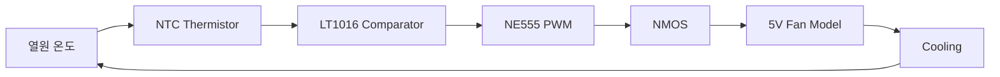

[README_fixed.md](https://github.com/user-attachments/files/31764946/README_fixed.md)
# LTspice Automatic Temperature Control Fan

> NTC Thermistor, LT1016 Comparator, NE555, NMOS, Fan Macro Model을 이용한  
> **폐루프 자동 온도 제어 시스템 설계 및 LTspice 시뮬레이션 프로젝트**

---

## 1. Project Overview

본 프로젝트는 열원의 온도가 일정 수준 이상으로 상승하면 냉각팬을 자동으로 작동시키고,
온도가 충분히 감소하면 팬을 정지시키는 **자동 온도 제어 시스템**을 LTspice로 설계한 프로젝트입니다.

단순한 ON/OFF 회로가 아니라 다음과 같은 폐루프 구조를 구현하였습니다.



**온도 감지 → 임계값 판단 → PWM 생성 → MOSFET 스위칭 → 팬 구동 → 냉각 → 온도 피드백**

의 전체 신호 흐름을 시뮬레이션하고 각 단계의 동작을 검증하는 것을 목표로 하였습니다.

---

## 2. Design Target

- 약 50℃에서 팬 작동
- 약 45℃까지 냉각되면 팬 정지
- 임계점 부근의 반복적인 ON/OFF(Chattering) 방지
- MOSFET을 이용한 Fan 전력 스위칭
- 유도성 부하의 역기전력 보호
- 팬 동작 결과가 열원 온도에 다시 반영되는 폐루프 구현
- LTspice Transient Analysis를 통한 시스템 검증

---

## 3. Final Simulation Result

최종 회로의 NTC 특성과 Comparator 기준전압을 계산한 결과 다음과 같은 임계값을 얻었습니다.

| Parameter | Result |
|---|---:|
| Fan ON Temperature | 약 **49.3℃** |
| Fan OFF Temperature | 약 **45.5℃** |
| Hysteresis Width | 약 **3.8℃** |
| Temperature Range | 약 **45~49℃** |
| LT1016 Output | 약 **0~3.7V** |
| NE555 Output | 약 **0~5V** |
| MOSFET Gate | 약 **0~5V** |

팬이 정지하면 열원 온도가 상승하고, 상한 임계온도에 도달하면 팬이 작동합니다.
팬의 냉각으로 온도가 하한 임계값까지 감소하면 팬이 다시 정지합니다.

이 동작이 반복되면서 열원 온도가 설정된 범위 안에서 유지되는 것을 확인하였습니다.

---

## 4. System Architecture

```text
열원 및 열용량 모델
        ↓
NTC Thermistor
        ↓
센서 전압 생성
        ↓
LT1016 Comparator
        ↓
Hysteresis 기반 ON/OFF 판단
        ↓
NE555 PWM
        ↓
NMOS Gate
        ↓
5V Fan Model
        ↓
RPM 신호
        ↓
냉각량 변화
        ↓
열원 온도 Feedback
```

---

## 5. Key Circuit Blocks

| Block | Component | Function |
|---|---|---|
| Thermal Model | `B_TH`, `C_TH` | 가열·자연 방열·팬 냉각 및 열관성 모델링 |
| Temperature Sensor | NTC Thermistor | 온도 변화에 따른 저항 변화 |
| Voltage Divider | R3 10kΩ + R4 NTC | NTC 저항을 센서전압으로 변환 |
| Reference Voltage | R6 10kΩ + R9 3.9kΩ | Comparator 기준전압 생성 |
| Hysteresis | R5 68kΩ | Fan ON/OFF 임계온도 분리 |
| Comparator | LT1016 | 센서전압과 기준전압 비교 |
| PWM Generator | NE555 | MOSFET Gate 구동용 PWM 생성 |
| Gate Resistor | R2 100Ω | Gate 충·방전 순간전류 제한 |
| Power Switch | NMOS | Fan 전류 Low-side Switching |
| Protection Diode | 1N5819 | 유도성 부하의 역기전력 억제 |
| Fan Model | `FAN5V.lib` | Fan 동작 및 RPM 신호 모델 |

---

## 6. Thermal Model

LTspice는 전압과 전류를 계산하는 회로 시뮬레이터이므로,
본 프로젝트에서는 열원의 온도를 계산하기 위해 다음 대응 관계를 사용하였습니다.

```text
TEMP_MON의 1V = 1℃
```

예를 들어 `V(TEMP_MON)=48V`는 실제 전원전압 48V가 아니라
**열 모델에서 48℃를 나타내는 계산용 값**입니다.

주요 파라미터는 다음과 같습니다.

```spice
.param Tamb=25
.param Rth=5
.param Cth=0.5
.param Pheat=6
.param Pcool=15

C_TH TEMP_MON 0 {Cth} IC=40

B_TH 0 TEMP_MON I={
 Pheat
 -(V(TEMP_MON)-Tamb)/Rth
 -Pcool*if(V(RPM)>0.5,1,0)
}
```

팬이 계속 정지해 있다고 가정하면 열원의 평형온도는

```text
Teq = Tamb + Pheat × Rth
    = 25 + 6 × 5
    = 55℃
```

를 향해 상승합니다.

팬이 작동하면 냉각항 `Pcool`이 적용되어 온도가 감소합니다.

---

## 7. NTC Temperature Sensing

NTC Thermistor는 온도가 상승할수록 저항이 감소하는 소자입니다.

본 프로젝트에서는 다음 Beta 모델을 사용하였습니다.

```spice
.param Beta=3950
.param R25=10000
```

센서의 동작은 다음과 같습니다.

```text
Temperature ↑
      ↓
NTC Resistance ↓
      ↓
Sensor Voltage ↓
      ↓
Comparator State Change
```

R3 10kΩ과 NTC를 이용한 분압회로를 통해
온도에 따른 저항 변화를 Comparator가 비교할 수 있는 전압 변화로 변환하였습니다.

---

## 8. Comparator & Hysteresis

하나의 임계온도만 사용하면 경계점 부근에서 작은 온도 변화에도
팬이 빠르게 ON/OFF를 반복하는 Chattering이 발생할 수 있습니다.

이를 방지하기 위해 LT1016 출력의 일부를 R5 68kΩ을 통해 기준전압 측으로 되돌리는
**Positive Feedback**을 적용하였습니다.

그 결과 다음과 같이 서로 다른 ON/OFF 온도가 형성됩니다.

```text
온도 상승
   ↓
약 49.3℃
   ↓
 FAN ON
   ↓
  냉각
   ↓
약 45.5℃
   ↓
 FAN OFF
```

따라서 약 **3.8℃의 Hysteresis Band**를 형성할 수 있었습니다.

---

## 9. Power Switching Stage

Comparator가 직접 팬 전류를 공급하지 않도록 NMOS를 Low-side Switch로 사용하였습니다.

```text
LT1016
   ↓
NE555 PWM
   ↓
R2 100Ω
   ↓
NMOS Gate
   ↓
Fan Current
```

Gate 저항은 MOSFET Gate의 충·방전 순간전류를 제한하는 역할을 합니다.

또한 팬은 유도성 부하이므로 MOSFET OFF 순간 발생할 수 있는 역기전력을 억제하기 위해
1N5819 Schottky Diode를 사용하였습니다.

---

## 10. Engineering Challenges

프로젝트에서는 완성된 회로뿐 아니라 문제를 발견하고 수정해 나간 과정을 기록하였습니다.

대표적인 시행착오는 다음과 같습니다.

1. Comparator 단일 임계값에서 발생할 수 있는 Chattering 문제
2. LTspice 예약어 `temp`와 사용자 변수명의 충돌
3. 단순 RL 부하를 Motor로 사용했을 때의 모델링 한계
4. MOSFET Source 저항으로 인한 `VGS` 감소 문제
5. 유도성 부하에서 Flyback Diode가 필요한 이유
6. Fan 동작을 열 모델에 다시 반영하기 위한 폐루프 구성

자세한 내용은 [시행착오 기록](docs/04_시행착오.md)에 정리하였습니다.

---

## 11. What I Learned

### Analog Circuit
- Voltage Divider
- NTC Thermistor
- Reference Voltage
- Comparator
- Positive Feedback
- Hysteresis
- NE555

### Power Electronics
- NMOS Low-side Switching
- `VGS`, `VDS`, `IDS`
- Gate Resistance
- Inductive Load
- Back EMF
- Flyback Diode

### Simulation & Modeling
- LTspice Transient Analysis
- Behavioral Source
- Parameter Modeling
- NTC Beta Equation
- Thermal Equivalent Circuit
- Macro Model
- Waveform Analysis

### Engineering Process
- 문제 재현
- 원인 분석
- 가설 수립
- 회로 수정
- 재시뮬레이션
- 결과 비교
- 모델의 한계 분석

---

## 12. Documentation

| Document | Description |
|---|---|
| [01. 소자 공부](docs/01_소자공부.md) | 최종 회로에 사용된 주요 소자와 회로 개념 |
| [02. 동작 원리](docs/02_동작원리.md) | 전체 시스템 및 각 블록의 동작 원리 |
| [03. 피드백 전 설계](docs/03_피드백%20전%20설계.md) | 폐루프 적용 전 초기 설계 |
| [04. 시행착오](docs/04_시행착오.md) | 문제 발생, 원인 분석 및 개선 과정 |
| [05. AI 활용 및 회로 검증](docs/05_gpt%20를%20이용한%20회로%20수정.md) | AI를 활용한 분석과 검증 기록 |
| [Simulation](docs/시뮬레이션.md) | 최종 회로 및 시뮬레이션 상세 분석 |
| [Final Result](docs/결과물.md) | 최종 결과 요약 |

---

## 13. Project Focus

본 프로젝트의 핵심은 단순히 팬을 작동시키는 것이 아니라,

> **센서 신호를 아날로그 회로로 처리하고, 제어 신호를 생성하여 MOSFET으로 전력 부하를 구동한 뒤, 그 결과를 다시 센서 입력에 반영하는 전체 신호 흐름을 이해하는 것**

입니다.

이를 통해 Analog Circuit, Power Semiconductor Switching,
Sensor Interface, Feedback Control 및 Circuit Simulation 사이의 연관성을 학습하였습니다.

---

## Tools

- LTspice
- GitHub
- Markdown
- Circuit Simulation
- AI-assisted Debugging & Verification

---

## Author

**김의겸**  
Electrical / Electronic Engineering Portfolio Project
