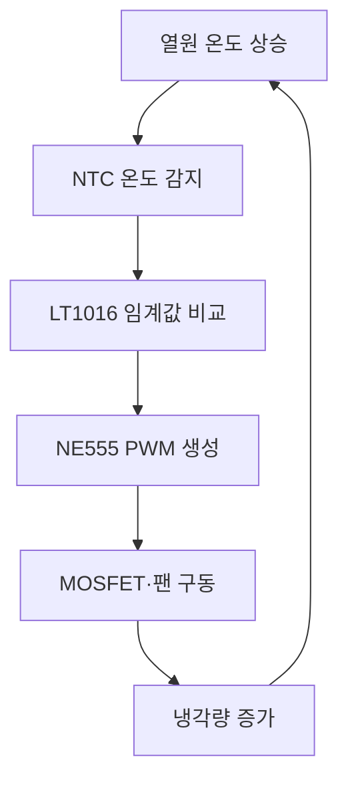

Automatic Temperature Control Fan 동작 원리
1. 프로젝트 개요

본 프로젝트는 NTC Thermistor로 온도를 감지하고, 설정 온도 이상에서 팬을 자동으로 작동시켜 열원을 냉각하는 폐루프 온도 제어 시스템이다.

단순히 정해진 시간에 팬을 켜고 끄는 것이 아니라 다음과 같은 피드백 구조를 구현하였다.
확인 완료. 4번 `V(n006)`은 회로 파일상 **NE555 출력이 R2(100Ω)를 지난 뒤의 MOSFET 게이트 전압**입니다. 아래 내용은 실제 `.asc`, `FAN5V.lib`, 네 장의 파형을 기준으로 작성한 GitHub 복붙용 문서입니다.

---

# Automatic Temperature Control Fan 동작 원리

## 1. 프로젝트 개요

본 프로젝트는 NTC Thermistor로 온도를 감지하고, 설정 온도 이상에서 팬을 자동으로 작동시켜 열원을 냉각하는 폐루프 온도 제어 시스템이다.

단순히 정해진 시간에 팬을 켜고 끄는 것이 아니라 다음과 같은 피드백 구조를 구현하였다.



설계 목표는 다음과 같다.

* 온도 상승 시 약 50℃에서 팬 작동
* 팬 냉각 후 약 45℃에서 팬 정지
* 팬이 짧은 간격으로 계속 켜지고 꺼지는 채터링 방지
* 온도 → 팬 → 냉각 → 온도로 이어지는 폐루프 구현
* LTspice에서 반복적인 가열과 냉각 동작 확인

전체 신호 전달 순서는 다음과 같다.

```text
온도 모델
   ↓
NTC Thermistor
   ↓
LT1016 Comparator
   ↓
NE555 PWM Generator
   ↓
NMOS Gate
   ↓
5V Fan Model
   ↓
RPM 신호
   ↓
냉각량 변화
   ↓
다시 온도 모델로 피드백
```

---

## 2. 주요 회로 구성

| 구분      | 실제 회로 요소                   | 역할                    |
| ------- | -------------------------- | --------------------- |
| 온도 모델   | `C_TH`, `B_TH`             | 열용량과 가열·냉각 현상 구현      |
| 온도센서    | R4, NTC Beta 식             | 온도를 저항값으로 변환          |
| 센서 분압   | R3 10kΩ, R4 NTC            | 온도를 비교 가능한 전압으로 변환    |
| 기준전압    | R6 10kΩ, R9 3.9kΩ          | 비교기의 기준전압 생성          |
| 히스테리시스  | R5 68kΩ                    | 팬 ON/OFF 온도를 다르게 설정   |
| 비교기     | U3 LT1016                  | 센서전압과 기준전압 비교         |
| PWM 발생기 | U1 NE555                   | MOSFET 구동용 펄스 생성      |
| 게이트 저항  | R2 100Ω                    | MOSFET 게이트 충·방전 전류 제한 |
| 스위칭 소자  | M1 `NMOS_FAN`              | 팬 전류의 로우사이드 스위칭       |
| 팬 모델    | `FAN5V.lib`                | 팬의 코일과 RPM 출력 모사      |
| 보호 다이오드 | D3 1N5819                  | 팬 코일의 역기전력 억제         |
| 해석 명령   | `.tran 0 60 0 10m startup` | 60초 동안 과도상태 분석        |

---

## 3. 열 등가회로를 이용한 온도 모델

### 3.1 온도를 전압으로 표현한 이유

LTspice는 기본적으로 전압과 전류를 계산하는 회로 시뮬레이터이다. 따라서 실제 온도를 직접 계산하는 대신 다음과 같이 대응시켰다.

```text
TEMP_MON 노드의 1V = 1℃
```

예를 들어,

```text
V(TEMP_MON) = 48V
```

라면 이것은 실제 회로의 48V 전압을 의미하는 것이 아니라, 모델 내부에서 **48℃를 나타내는 계산용 전압**이다.

따라서 1번 파형에서 파란색 `V(temp_mon)`이 약 45~49V 사이를 움직이는 것은 온도가 약 45~49℃ 사이를 반복한다는 뜻이다.

### 3.2 실제 열 모델 식

회로 파일에 사용한 조건은 다음과 같다.

```spice
.param Tamb=25
.param Rth=5
.param Cth=0.5
.param Pheat=6
.param Pcool=15

C_TH TEMP_MON 0 {Cth} IC=40

B_TH 0 TEMP_MON I={
 Pheat
 -(V(TEMP_MON)-Tamb)/Rth
 -Pcool*if(V(RPM)>0.5,1,0)
}
```

각 변수의 의미는 다음과 같다.

| 변수      | 설정값 | 의미               |
| ------- | --: | ---------------- |
| `Tamb`  |  25 | 주변 온도 25℃        |
| `Rth`   |   5 | 열저항 5℃/W에 해당하는 값 |
| `Cth`   | 0.5 | 열용량에 해당하는 값      |
| `Pheat` |   6 | 열원에서 계속 발생하는 가열량 |
| `Pcool` |  15 | 팬 작동 시 적용되는 냉각량  |
| `IC`    |  40 | 시뮬레이션 시작 온도 40℃  |

이 회로가 표현하는 열평형식은 다음과 같다.

[
C_{th}\frac{dT}{dt}
===================

## P_{heat}

## \frac{T-T_{amb}}{R_{th}}

P_{cool}\cdot Fan
]

여기서 `Fan`은 다음 두 상태만 가진다.

[
Fan=
\begin{cases}
0, & V(RPM)\leq0.5\
1, & V(RPM)>0.5
\end{cases}
]

### 3.3 팬이 정지했을 때

팬이 정지하면 냉각항이 0이 되므로 열원에서 발생하는 열 때문에 온도가 상승한다.

팬이 계속 꺼져 있을 때 계산되는 최종 평형온도는 다음과 같다.

[
T_{eq}=T_{amb}+P_{heat}R_{th}
]

[
T_{eq}=25+(6\times5)=55℃
]

따라서 팬이 없으면 온도는 최종적으로 약 55℃를 향해 상승한다.

### 3.4 팬이 작동했을 때

`V(RPM)>0.5` 조건이 만족되면 `Pcool=15`가 적용된다. 이 값은 가열량 `Pheat=6`보다 크기 때문에 온도가 감소한다.

온도가 떨어져 팬 정지 임계값에 도달하면 비교기 출력이 다시 바뀌고 냉각항이 제거된다. 그러면 열원에 의해 온도가 다시 상승한다.

이 과정이 반복되면서 1번 파형과 같은 톱니 모양의 온도 변화가 발생한다.

---

## 4. NTC Thermistor의 온도 감지 원리

R4에는 다음 Beta 식을 사용하였다.

```spice
.param Beta=3950
.param R25=10000

R=R25*exp(
 Beta*(1/(V(TEMP_MON)+273.15)-1/298.15)
)
```

수식으로 표현하면 다음과 같다.

[
R_{NTC}(T)
==========

R_{25}
\exp
\left[
B\left(
\frac{1}{T+273.15}
------------------

\frac{1}{298.15}
\right)
\right]
]

여기서:

* (R_{25}=10k\Omega)
* (B=3950)
* (T)는 `TEMP_MON`으로 표현된 온도이다.
* `273.15`는 섭씨온도를 절대온도로 변환하기 위해 사용한다.
* `298.15K`는 25℃에 해당한다.

이 NTC는 온도가 올라가면 저항이 감소한다.

|  온도 | 계산된 NTC 저항 |
| --: | ---------: |
| 40℃ |   약 5.30kΩ |
| 45℃ |   약 4.35kΩ |
| 48℃ |   약 3.87kΩ |
| 49℃ |   약 3.73kΩ |
| 50℃ |   약 3.59kΩ |

NTC 자체는 저항만 변하기 때문에 LT1016이 바로 온도를 비교할 수 없다. 따라서 R3 10kΩ과 R4 NTC를 분압회로로 구성하여 저항 변화를 전압 변화로 바꿨다.

센서전압은 다음과 같이 계산된다.

[
V_{sensor}
==========

5
\frac{R_{NTC}}{10k+R_{NTC}}
]

온도가 올라가면 NTC 저항이 작아지고, 그 결과 `Vsensor`도 낮아진다.

즉 본 회로에서는 다음 관계가 성립한다.

```text
온도 상승 → NTC 저항 감소 → 센서전압 감소
온도 하강 → NTC 저항 증가 → 센서전압 증가
```

이 센서전압은 LT1016의 반전 입력 `−IN`에 전달된다.

---

## 5. 기준전압과 LT1016 비교기의 동작

### 5.1 기본 기준전압

비교기의 비반전 입력 `+IN`에는 R6 10kΩ과 R9 3.9kΩ으로 만든 기준전압이 연결되어 있다.

히스테리시스 저항 R5를 제외하고 단순 계산하면 다음과 같다.

[
V_{ref}
=======

5\frac{3.9k}{10k+3.9k}
]

[
V_{ref}\approx1.403V
]

이 기준전압과 NTC 분압에서 생성된 센서전압을 LT1016이 비교한다.

```text
+IN = 기준전압
−IN = NTC 센서전압
```

LT1016의 기본 동작은 다음과 같다.

```text
V(+IN) > V(−IN) → 출력 HIGH
V(+IN) < V(−IN) → 출력 LOW
```

온도가 올라가면 센서전압이 낮아지므로 일정 온도 이상에서 다음 조건이 만들어진다.

```text
기준전압 > 센서전압
```

따라서 LT1016 출력이 HIGH가 되어 NE555의 동작을 허용한다.

### 5.2 R5 68kΩ에 의한 히스테리시스

팬을 하나의 임계값만으로 제어하면 온도가 임계점 근처에서 조금만 흔들려도 팬이 매우 빠르게 켜지고 꺼질 수 있다. 이를 채터링이라고 한다.

본 회로에서는 LT1016 출력의 일부를 R5 68kΩ을 통해 기준전압 쪽으로 되돌리는 양의 피드백을 적용하였다. 이 때문에 팬을 켜는 온도와 끄는 온도가 달라진다.

실제 파형에서 LT1016 HIGH 출력은 약 3.7V이므로 이를 반영하면 두 기준전압은 대략 다음과 같이 계산된다.

#### LT1016 출력이 LOW일 때

[
V_{ref,L}
=========

\frac{
5/10k+0/68k
}{
1/10k+1/3.9k+1/68k
}
]

[
V_{ref,L}\approx1.347V
]

이 전압에 해당하는 NTC 저항과 온도를 계산하면 팬의 상승 측 작동 온도는 약 다음과 같다.

[
T_{ON}\approx49.3℃
]

#### LT1016 출력이 HIGH일 때

[
V_{ref,H}
=========

\frac{
5/10k+3.7/68k
}{
1/10k+1/3.9k+1/68k
}
]

[
V_{ref,H}\approx1.494V
]

이 전압에 해당하는 냉각 측 정지 온도는 약 다음과 같다.

[
T_{OFF}\approx45.5℃
]

따라서 본 회로의 이론적인 히스테리시스 구간은 대략 다음과 같다.

```text
온도 상승: 약 49.3℃에서 팬 ON
온도 하강: 약 45.5℃에서 팬 OFF
```

목표로 설정했던 45~50℃와 상당히 가까운 결과이다.

1번 파형이 처음에 40℃에서 시작하는 이유는 팬의 OFF 임계값이 40℃이기 때문이 아니다. 열 모델에서 다음 초기조건을 지정했기 때문이다.

```spice
C_TH TEMP_MON 0 {Cth} IC=40
```

따라서 약 40℃는 단순한 시뮬레이션 시작 온도이고, 정상적인 반복 동작이 시작된 후의 하한 온도는 약 45~46℃이다.

---

## 6. LT1016 출력 파형 분석

3번 파형은 LT1016 출력 노드 `V(n003)`이다.

파형에서 확인되는 출력 범위는 대략 다음과 같다.

```text
LOW  ≈ 0V
HIGH ≈ 3.7V
```

LT1016 출력이 주기적으로 HIGH와 LOW를 반복한다는 것은 NTC 센서전압이 히스테리시스의 두 임계값을 반복해서 통과하고 있다는 뜻이다.

```text
온도 약 49.3℃ 도달
    ↓
센서전압 감소
    ↓
LT1016 출력 HIGH
    ↓
팬 구동 허용
    ↓
온도 하강
    ↓
온도 약 45.5℃ 도달
    ↓
LT1016 출력 LOW
```

HIGH가 약 5V가 아니라 3.7V 부근에 나타나는 것은 LT1016의 실제 출력단 특성과 부하 상태가 반영된 결과이다. 중요한 것은 이 전압이 다음 단계인 NE555의 RESET 제어 입력을 활성화할 수 있을 정도로 충분히 높다는 점이다.

---

## 7. NE555의 역할과 출력 파형

LT1016은 팬에 필요한 전류를 직접 공급하는 부품이 아니다. LT1016은 “현재 온도가 팬을 켜야 하는 상태인지”를 판단하는 비교기 역할만 담당한다.

LT1016 출력은 NE555의 RESET 제어단으로 전달된다.

```text
LT1016 LOW
→ NE555 RESET 상태
→ NE555 출력 정지
→ MOSFET OFF
→ 팬 정지

LT1016 HIGH
→ NE555 동작 허용
→ PWM 펄스 생성
→ MOSFET 스위칭
→ 팬 작동
```

NE555 주변의 R1 4.7kΩ, R8 4.7kΩ, R11 15kΩ, D1, D2, C2 100nF는 충전 경로와 방전 경로를 구성한다. D1과 D2가 서로 반대 방향으로 배치되어 있어 C2가 충전될 때와 방전될 때 서로 다른 저항 경로를 사용한다.

이 방식은 NE555의 HIGH 시간과 LOW 시간을 분리해 PWM 듀티비를 조정하는 데 사용된다.

2번 `V(n005)`는 회로 파일상 NE555 출력 노드이며, 파형은 약 다음 범위에서 움직인다.

```text
LOW  ≈ 0V
HIGH ≈ 5V
```

파형이 가느다란 선 또는 두꺼운 직사각형 묶음처럼 보이는 이유는 높은 주파수의 여러 PWM 펄스가 긴 시간축에 압축되어 표시되었기 때문이다.

따라서 파형을 해석할 때 다음 두 동작을 구분해야 한다.

* 각각의 빠른 펄스: NE555가 만드는 PWM 스위칭
* 펄스가 나타나는 전체 구간: LT1016이 NE555 동작을 허용한 팬 구동 구간

즉 LT1016이 온도에 따라 큰 구간의 ON/OFF를 결정하고, 그 구간 안에서 NE555가 빠른 PWM을 생성한다.

---

## 8. MOSFET 게이트 전압 파형

4번 `V(n006)`은 NE555 출력이 R2 100Ω을 통과한 뒤의 **M1 MOSFET 게이트 전압**이다.

```text
NE555 OUT ─ R2 100Ω ─ M1 Gate
```

따라서 4번 파형은 MOSFET의 드레인 전압이나 팬 양단 전압이 아니라 게이트 구동 신호이다.

파형에서 다음과 같은 전압 범위가 확인된다.

```text
Gate LOW  ≈ 0V
Gate HIGH ≈ 5V
```

회로에서 사용한 MOSFET 모델은 다음과 같다.

```spice
.model NMOS_FAN NMOS(
 Level=1
 Vto=2
 Kp=20
 Lambda=0.01
)
```

문턱전압 `Vto`가 2V이므로 게이트가 5V일 때 MOSFET은 충분히 ON 상태가 된다.

```text
게이트 0V
→ M1 OFF
→ FAN_MINUS 전류 경로 차단
→ 팬 정지

게이트 5V
→ M1 ON
→ FAN_MINUS가 GND 방향으로 연결
→ 팬 전류 흐름
→ 팬 작동
```

R2 100Ω은 MOSFET이 켜지고 꺼지는 순간 게이트 커패시턴스로 흐르는 순간 전류를 제한하고, NE555 출력과 MOSFET 사이의 급격한 스위칭을 완화하는 역할을 한다.

2번 `V(n005)`와 4번 `V(n006)`의 파형이 거의 동일한 이유도 이 때문이다. R2는 직렬 게이트 저항이므로 정상상태에서는 전압강하가 거의 없고, 주로 스위칭 순간에만 영향을 준다.

---

## 9. MOSFET 로우사이드 스위칭과 D3 보호

M1은 팬의 아래쪽 전류 경로를 제어하는 로우사이드 스위치로 사용되었다.

```text
5V 전원
  ↓
팬 모델
  ↓
FAN_MINUS
  ↓
M1 Drain
M1 Source
  ↓
GND
```

MOSFET이 ON되면 팬 전류가 팬 코일과 MOSFET을 거쳐 GND로 흐른다. MOSFET이 OFF되면 전류 경로가 차단되어 팬이 정지한다.

팬 모델에는 인덕턴스가 포함되어 있으므로 MOSFET이 갑자기 꺼질 때 코일은 기존 전류를 계속 유지하려고 한다. 이 과정에서 높은 역기전력이 발생할 수 있다.

D3에는 Schottky 다이오드인 1N5819를 사용하였다. D3는 MOSFET이 꺼지는 순간 팬 코일 전류가 순환할 수 있는 경로를 만들어 MOSFET 드레인에 큰 과도전압이 발생하는 것을 억제한다.

---

## 10. FAN5V 모델과 RPM 신호

사용한 팬 라이브러리는 다음과 같다.

```spice
.subckt FAN5V P N RPM
Rcoil P X 8
Lcoil X N 300u
Bspeed RPM 0 V={limit(V(P,N),0,5)*2.0}
Rrpm RPM 0 1Meg
.ends FAN5V
```

### 10.1 팬 코일 모델

팬의 전기적 특성은 다음 두 소자로 단순화하였다.

* `Rcoil=8Ω`: 팬 권선의 저항 성분
* `Lcoil=300µH`: 팬 권선의 인덕턴스 성분

이 모델은 실제 BLDC 팬의 드라이버 IC, 회전자 관성, 마찰, 토크, 역기전력 등을 모두 구현한 정밀 모터 모델은 아니다. 팬 전원단의 저항·인덕턴스 특성과 속도 표시를 간단하게 확인하기 위한 등가모델이다.

### 10.2 RPM 출력의 단위

RPM 출력은 다음 식으로 생성된다.

```spice
Bspeed RPM 0 V={limit(V(P,N),0,5)*2.0}
```

팬 양단전압이 0~5V 범위를 벗어나지 않도록 제한한 뒤 2배하여 RPM 표시 신호를 만든다.

라이브러리의 기준은 다음과 같다.

```text
V(RPM) 1V = 1000rpm
```

따라서:

| `V(RPM)` | 모델이 나타내는 회전속도 |
| -------: | ------------: |
|       0V |          0rpm |
|       2V |      2,000rpm |
|       5V |      5,000rpm |
|      10V |     10,000rpm |

1번 파형에서 초록색 `V(rpm)`이 약 10V까지 올라가는 것은 실제 RPM 신호선에 10V 전원이 걸렸다는 뜻이 아니라, 모델이 약 10,000rpm을 표시하고 있다는 뜻이다.

다만 이 값은 실제 팬의 기계적인 회전속도를 해석한 결과가 아니다. 팬 양단전압을 단순 환산한 표시값이므로 실제 제작 단계에서는 팬 데이터시트와 타코미터 측정값을 이용해 보정해야 한다.

---

## 11. 전체 폐루프 동작 과정

### 11.1 초기 가열 구간

시뮬레이션은 `IC=40` 조건에 따라 40℃에서 시작한다. 초기에는 팬이 꺼져 있으므로 `Pheat=6`에 의해 온도가 상승한다.

```text
팬 OFF
→ 냉각항 제거
→ 열원에 의해 온도 상승
→ NTC 저항 감소
→ 센서전압 감소
```

### 11.2 팬 작동

온도가 약 49.3℃에 도달하면 NTC 센서전압이 비교기의 상승 측 기준전압보다 낮아진다.

```text
V(+IN) > V(−IN)
→ LT1016 출력 HIGH
→ NE555 RESET 해제
→ NE555 PWM 출력 발생
→ MOSFET 게이트 0~5V 스위칭
→ 팬 작동
→ V(RPM) 상승
```

### 11.3 냉각 구간

RPM 신호가 0.5V보다 높아지면 열 모델의 냉각 조건이 활성화된다.

```spice
Pcool*if(V(RPM)>0.5,1,0)
```

이에 따라 `Pcool=15`가 적용되고 온도가 감소하기 시작한다.

### 11.4 팬 정지

온도가 약 45.5℃까지 떨어지면 NTC 저항과 센서전압이 다시 증가한다.

```text
V(−IN) > V(+IN)
→ LT1016 출력 LOW
→ NE555 RESET
→ PWM 출력 정지
→ MOSFET 게이트 0V
→ 팬 정지
→ 냉각항 제거
```

팬이 정지하면 열원에 의해 온도가 다시 상승한다. 이 과정이 반복되면서 온도가 일정 범위 안에 유지된다.

---

## 12. 최종 파형 결과 분석

### 12.1 온도 및 RPM 파형

1번 파형에서 파란색 `V(temp_mon)`은 온도를 나타내며 약 45~49℃ 사이에서 톱니 형태로 반복된다.

초록색 `V(rpm)`은 온도가 상한값에 도달했을 때 발생하고, 온도가 하한값까지 냉각되면 다시 0으로 내려간다.

이를 통해 다음 폐루프 동작을 확인하였다.

```text
온도 상승 → RPM 발생 → 온도 하강
온도 하강 → RPM 제거 → 온도 재상승
```

### 12.2 LT1016 출력

3번 `V(n003)`은 약 0~3.7V의 디지털 형태로 변한다. 이는 온도 임계값 판단 결과가 정상적으로 출력되고 있음을 의미한다.

### 12.3 NE555 출력

2번 `V(n005)`는 약 0~5V의 PWM 파형이다. LT1016 출력이 HIGH인 구간에서만 PWM이 나타나므로 온도 비교 결과가 NE555의 동작 여부를 제어하고 있음을 확인할 수 있다.

### 12.4 MOSFET 게이트 전압

4번 `V(n006)`은 약 0~5V로 스위칭된다. NE555 출력과 거의 같은 형태이므로 NE555의 PWM이 R2를 통과하여 MOSFET 게이트까지 정상적으로 전달되고 있음을 보여준다.

| 측정 위치         |    파형 범위 | 확인된 기능        |
| ------------- | -------: | ------------- |
| `V(temp_mon)` | 약 45~49V | 온도 45~49℃ 반복  |
| `V(rpm)`      |  약 0~10V | 팬 정지와 작동 반복   |
| `V(n003)`     | 약 0~3.7V | LT1016 온도 판단  |
| `V(n005)`     |   약 0~5V | NE555 PWM 출력  |
| `V(n006)`     |   약 0~5V | MOSFET 게이트 구동 |

---

## 13. R10 중복 배선에 대한 분석

R10 100Ω은 LT1016 출력과 NE555 RESET 입력 사이에 배치되어 있다. 그러나 최종 파일에서는 R10 양단이 전선으로 직접 연결되어 있어 저항이 우회된 상태이다.

```text
LT1016 OUT ───────── NE555 RESET
             │
           R10
             │
          전선으로 우회
```

따라서 현재 시뮬레이션에서는 R10이 전기적인 역할을 하지 않는다.

그런데도 회로가 작동하는 이유는 NE555 RESET 단자가 전력 부하가 아니라 입력 임피던스가 높은 논리 제어 단자이기 때문이다. LT1016 출력이 RESET 입력을 직접 구동해도 큰 전류가 흐르지 않아 시뮬레이션 동작에는 문제가 나타나지 않았다.

다만 실제 회로 제작에서는 다음 이유로 중복 배선을 제거하는 것이 맞다.

* 배선 실수를 그대로 남기면 회로 의도가 불분명해진다.
* 출력단 과도전류를 제한하려는 R10의 목적이 사라진다.
* PCB 설계와 회로 검토 과정에서 오류로 지적될 수 있다.
* 포트폴리오 회로도는 실제로 동작하는 연결뿐 아니라 설계 의도도 명확해야 한다.

따라서 현재 결과는 정상 동작으로 인정할 수 있지만, 최종 회로도에서는 우회 전선을 삭제하여 다음처럼 수정할 예정이다.

```text
LT1016 OUT ─ R10 100Ω ─ NE555 RESET
```

---

## 14. 시뮬레이션 모델의 한계

본 프로젝트는 전체 제어 흐름을 검증하기 위한 시스템 수준의 시뮬레이션이며, 다음과 같은 한계가 있다.

1. `TEMP_MON`은 실제 온도가 아니라 `1V=1℃`로 대응시킨 계산용 노드이다.

2. 팬의 냉각량은 RPM에 비례하지 않는다. 현재 모델은 `V(RPM)>0.5`가 되면 `Pcool=15` 전체가 즉시 적용되는 ON/OFF 방식이다.

3. `FAN5V.lib`의 RPM은 팬 양단전압을 변환한 표시 신호이다. 회전자 관성, 토크, 마찰 및 실제 RPM 상승·감소 시간은 계산하지 않는다.

4. MOSFET은 `Level=1` 단순 모델이므로 실제 부품의 도통저항, 게이트 전하, 발열 및 스위칭 손실이 정확히 반영되지 않는다.

5. NTC는 이상적인 Beta 식을 사용한다. 실제 NTC의 허용오차, 자기발열, 배선저항 및 응답 지연은 포함되지 않는다.

6. 실제 팬은 PWM 주파수와 듀티비가 너무 낮으면 정지하거나 재기동하지 못할 수 있다. 현재 모델에서는 이러한 기동 실패가 나타나지 않는다.

따라서 겨울방학 실물 제작 단계에서는 실제 NTC 온도, 팬 기동전압, MOSFET 온도, PWM 듀티비, 실제 RPM 및 45~50℃ 제어 범위를 다시 측정해야 한다.

---

## 15. 결론

본 프로젝트에서는 NTC Thermistor, LT1016, NE555, NMOS 및 5V 팬 등가모델을 이용하여 자동 온도 제어 팬 시스템을 구현하였다.

NTC의 비선형적인 저항 변화를 분압전압으로 변환하고, LT1016이 이를 기준전압과 비교하도록 구성하였다. 또한 R5 68kΩ의 양의 피드백으로 약 49.3℃에서 팬이 작동하고 약 45.5℃에서 정지하는 히스테리시스를 형성하였다.

LT1016의 약 0~3.7V 출력은 NE555의 동작을 제어하고, NE555는 약 0~5V의 PWM을 생성한다. 이 신호는 R2 100Ω을 통해 MOSFET 게이트로 전달되어 팬 전류를 스위칭한다.

최종 파형에서는 온도, RPM, 비교기 출력, NE555 출력 및 MOSFET 게이트 전압이 서로 연동되어 반복적으로 변하는 것을 확인하였다. 이를 통해 단순한 온도 입력 시험을 넘어 팬의 작동 결과가 다시 냉각량과 온도에 영향을 주는 폐루프 제어 구조가 정상적으로 구현되었음을 검증하였다.

특히 초기온도 40℃와 실제 팬 정지 임계값을 구분하고, 회로값을 이용해 약 45.5~49.3℃의 이론적 제어 범위를 직접 계산함으로써 파형이 나타나는 원인을 정량적으로 분석하였다. 다만 현재 팬과 열 모델은 단순화된 등가모델이므로 향후 실물 제작에서는 실제 부품의 오차와 열적·기계적 특성을 반영한 추가 검증이 필요하다.

https://chatgpt.com/s/t_6a73f5490d9c8191b6ea2cae6c66d6af 
