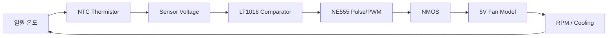

[02_동작원리_revised.md](https://github.com/user-attachments/files/31765032/02_._revised.md)
# 02. Automatic Temperature Control Fan 동작 원리

> NTC Thermistor → LT1016 Comparator → NE555 → NMOS → Fan → Thermal Feedback  
> 최종 LTspice 회로를 기준으로 전체 신호 흐름과 각 블록의 동작을 정리한 문서

---

## 1. 프로젝트 동작 개요

본 프로젝트는 열원의 온도가 상승하면 팬을 자동으로 작동시키고,
충분히 냉각되면 팬을 정지시키는 **폐루프 자동 온도 제어 시스템**이다.

단순히 외부에서 정해진 시간에 팬을 켜고 끄는 방식이 아니라,
팬의 동작 결과가 다시 열원 온도에 영향을 주도록 다음과 같은 Feedback 구조를 구성하였다.



전체 동작을 한 줄로 정리하면 다음과 같다.

> **온도 상승 → NTC 저항 감소 → 센서전압 감소 → Comparator 상태 전환 → NE555 구동 → NMOS Switching → Fan 작동 → 냉각 → 온도 하강**

설계 목표는 다음과 같다.

- 온도 상승 시 약 50℃ 부근에서 Fan ON
- 냉각 후 약 45℃ 부근에서 Fan OFF
- 임계점 부근의 빠른 ON/OFF 반복(Chattering) 방지
- Comparator와 Power Switching Stage의 역할 분리
- Fan 동작 결과가 다시 온도 모델에 반영되는 Closed-loop 구성
- LTspice Transient Analysis를 이용한 반복 가열·냉각 동작 확인

---

## 2. 최종 회로의 주요 블록

| 구분 | 회로 요소 | 역할 |
|---|---|---|
| Thermal Model | `B_TH`, `C_TH` | 가열, 자연 방열, Fan 냉각 및 열관성 모델링 |
| Temperature Sensor | R4 NTC | 온도를 저항 변화로 변환 |
| Sensor Divider | R3 10kΩ + R4 NTC | NTC 저항을 센서전압으로 변환 |
| Reference Voltage | R6 10kΩ + R9 3.9kΩ | Comparator 기본 기준전압 생성 |
| Hysteresis | R5 68kΩ | Fan ON/OFF 임계온도 분리 |
| Comparator | U3 LT1016 | 센서전압과 기준전압 비교 |
| Pulse/PWM Stage | U1 NE555 | NMOS Gate 구동 신호 생성 |
| Gate Resistor | R2 100Ω | MOSFET Gate 충·방전 순간전류 제한 |
| Power Switch | M1 `NMOS_FAN` | Fan 전류 Low-side Switching |
| Flyback Diode | D3 1N5819 | 유도성 부하의 역기전력 억제 |
| Fan Model | `FAN5V.lib` | Fan 전기적 부하와 RPM 표시 신호 모델링 |
| Analysis | `.tran 0 60 0 10m startup` | 60초 과도상태 해석 |

---

# 3. Thermal Equivalent Model

## 3.1 온도를 전압으로 표현한 이유

LTspice는 기본적으로 전압과 전류를 계산하는 전기회로 시뮬레이터이다.
따라서 열원의 온도를 직접 회로 노드에 입력하는 대신
온도를 전압과 대응시키는 방법을 사용하였다.

본 프로젝트의 대응 관계는 다음과 같다.

```text
TEMP_MON의 1V = 1℃
```

따라서

```text
V(TEMP_MON) = 48V
```

라는 결과는 실제 회로에 48V가 인가된다는 뜻이 아니라,
**열 모델 내부에서 열원 온도가 48℃임을 의미하는 계산용 값**이다.

---

## 3.2 사용한 열 모델

최종 회로에 사용한 파라미터는 다음과 같다.

```spice
.param Tamb=25
.param Rth=5
.param Cth=0.5
.param Pheat=6
.param Pcool=15

C_TH TEMP_MON 0 {Cth} IC=40

B_TH 0 TEMP_MON I={
 Pheat
 -(V(TEMP_MON)-Tamb)/Rth
 -Pcool*if(V(RPM)>0.5,1,0)
}
```

| 변수 | 값 | 의미 |
|---|---:|---|
| `Tamb` | 25 | 주변 온도 25℃ |
| `Rth` | 5 | 열저항에 대응하는 값 |
| `Cth` | 0.5 | 열용량에 대응하는 값 |
| `Pheat` | 6 | 열원에서 지속적으로 발생하는 가열량 |
| `Pcool` | 15 | Fan 동작 시 적용되는 냉각량 |
| `IC` | 40 | 시뮬레이션 시작 온도 40℃ |

이를 개념적으로 표현하면 다음과 같다.

```text
온도 변화율
= 가열
- 자연 방열
- Fan 냉각
```

즉,

```text
Cth · dT/dt
= Pheat
- (T - Tamb) / Rth
- Pcool · FanState
```

로 이해할 수 있다.

---

## 3.3 Fan이 꺼져 있을 때

Fan이 정지하면 냉각항은 적용되지 않는다.

이때 열원은 `Pheat=6`에 의해 계속 가열되고,
주변과의 온도차에 따른 자연 방열만 존재한다.

Fan이 계속 OFF라고 가정했을 때 평형온도는

```text
Teq = Tamb + Pheat × Rth
    = 25 + 6 × 5
    = 55℃
```

이므로 약 55℃를 향해 상승한다.

따라서 Fan 제어가 없다면 본 모델의 열원은
목표 상한 온도인 50℃를 넘어서 계속 상승하게 된다.

---

## 3.4 Fan이 켜졌을 때

`V(RPM)>0.5`가 되면 열 모델의 다음 항이 활성화된다.

```spice
-Pcool*if(V(RPM)>0.5,1,0)
```

이때 `Pcool=15`가 적용된다.

냉각량 15는 가열량 6보다 크므로 Fan ON 상태에서는
열원 온도가 감소하는 방향으로 동작한다.

```text
Fan OFF → 냉각항 없음 → 온도 상승
Fan ON  → 냉각항 적용 → 온도 하강
```

이 두 상태가 Comparator의 Hysteresis와 결합되면서
열원 온도가 일정 범위에서 반복적으로 상승·하강한다.

---

# 4. NTC Thermistor의 온도 감지

## 4.1 NTC 모델

R4에는 다음 Beta 모델을 사용하였다.

```spice
.param Beta=3950
.param R25=10000

R=R25*exp(Beta*(1/(V(TEMP_MON)+273.15)-1/298.15))
```

여기서

- `R25 = 10kΩ`
- `Beta = 3950`
- `V(TEMP_MON)` = ℃로 대응시킨 열원 온도

이다.

NTC의 핵심 특성은 다음과 같다.

```text
온도 상승 → NTC 저항 감소
온도 하강 → NTC 저항 증가
```

대표 온도에서의 계산값은 다음과 같다.

| 온도 | NTC 저항 |
|---:|---:|
| 40℃ | 약 5.30kΩ |
| 45℃ | 약 4.35kΩ |
| 48℃ | 약 3.87kΩ |
| 49℃ | 약 3.73kΩ |
| 50℃ | 약 3.59kΩ |

---

## 4.2 저항 변화를 전압으로 변환

Comparator는 저항값 자체를 비교하는 소자가 아니라
두 입력 **전압**을 비교한다.

따라서 R3 10kΩ과 NTC를 이용해 Voltage Divider를 구성하였다.

```text
5V
 │
R3 10kΩ
 │
 ├── Sensor Voltage
 │
R4 NTC
 │
GND
```

센서전압은 다음 관계를 가진다.

```text
Vsensor = 5 × RNTC / (10k + RNTC)
```

온도가 상승하면 NTC 저항이 감소하므로 Sensor Voltage 역시 감소한다.

```text
Temperature ↑
      ↓
RNTC ↓
      ↓
Vsensor ↓
```

이 Sensor Voltage가 LT1016의 비교 입력으로 전달된다.

---

# 5. Reference Voltage와 LT1016 Comparator

## 5.1 기본 Reference Voltage

최종 회로에서는 가변저항이 아니라
R6 10kΩ과 R9 3.9kΩ의 고정 분압을 이용하였다.

R5의 Feedback을 제외한 기본 기준전압은

```text
Vref = 5 × 3.9k / (10k + 3.9k)
     ≈ 1.403V
```

이다.

Comparator는 다음 두 전압을 비교한다.

```text
+IN : Reference Voltage
-IN : NTC Sensor Voltage
```

기본 동작은 다음과 같다.

```text
V(+IN) > V(-IN) → Output HIGH
V(+IN) < V(-IN) → Output LOW
```

온도가 올라가면 Sensor Voltage가 내려가므로
일정 온도를 넘으면 Reference Voltage가 Sensor Voltage보다 높아진다.

그 결과 LT1016의 출력 상태가 전환된다.

---

# 6. R5 68kΩ에 의한 Hysteresis

## 6.1 단일 임계값의 문제

Fan을 하나의 온도 기준으로만 ON/OFF하면
임계점 부근에서 다음과 같은 문제가 생길 수 있다.

```text
49.9℃ → OFF
50.0℃ → ON
49.9℃ → OFF
50.0℃ → ON
...
```

실제 시스템에서는 센서 노이즈나 작은 온도 변화 때문에
스위칭이 매우 빠르게 반복될 수 있다.

이를 Chattering이라고 한다.

---

## 6.2 Positive Feedback 적용

본 회로에서는 LT1016 출력 일부를
R5 68kΩ을 통해 Reference Voltage 노드로 되돌렸다.

```text
LT1016 Output
      │
    R5 68kΩ
      │
Reference Node
```

이 Positive Feedback 때문에
Comparator 출력 상태에 따라 기준전압이 달라진다.

즉 하나의 임계값이 아니라
**Fan을 켜는 온도와 끄는 온도가 서로 다른 두 개의 임계값**이 형성된다.

---

## 6.3 Fan ON 임계값 계산

LT1016 출력이 LOW일 때 출력전압을 약 0V로 두면
Reference Voltage는 약 다음과 같다.

```text
Vref,L
≈ (5/10k + 0/68k)
  / (1/10k + 1/3.9k + 1/68k)

≈ 1.347V
```

Sensor Voltage가 약 1.347V가 되는 NTC 저항은 약 3.69kΩ이고,
Beta 식으로 다시 온도로 환산하면

```text
Fan ON Temperature ≈ 49.3℃
```

가 된다.

---

## 6.4 Fan OFF 임계값 계산

시뮬레이션에서 LT1016 HIGH 출력은 약 3.7V로 관찰되었다.

이를 Feedback 계산에 반영하면

```text
Vref,H
≈ (5/10k + 3.7/68k)
  / (1/10k + 1/3.9k + 1/68k)

≈ 1.494V
```

가 된다.

이 전압에 해당하는 NTC 저항과 온도를 계산하면

```text
Fan OFF Temperature ≈ 45.5℃
```

가 된다.

따라서 최종 Hysteresis는

```text
Fan ON  : 약 49.3℃
Fan OFF : 약 45.5℃

Hysteresis Width
≈ 49.3 - 45.5
≈ 3.8℃
```

로 계산된다.

---

# 7. LT1016 출력의 역할

시뮬레이션에서 LT1016 출력 `V(n003)`은
대략 다음 범위에서 변하였다.

```text
LOW  ≈ 0V
HIGH ≈ 3.7V
```

이 신호는 Fan에 직접 전류를 공급하는 전력 출력이 아니라,
**현재 온도가 Fan을 구동해야 하는 상태인지 나타내는 제어 신호**이다.

전체 흐름은 다음과 같다.

```text
온도 약 49.3℃ 도달
        ↓
Sensor Voltage 감소
        ↓
LT1016 Output HIGH
        ↓
NE555 동작 허용
        ↓
Fan 구동
        ↓
온도 감소
        ↓
온도 약 45.5℃ 도달
        ↓
LT1016 Output LOW
```

즉 Comparator가 온도 제어의 상위 ON/OFF 판단을 담당한다.

---

# 8. NE555 Pulse/PWM Stage

## 8.1 NE555를 둔 이유

LT1016은 온도 상태를 판단하는 Comparator이고,
Fan 전류를 직접 Switching하기 위한 소자가 아니다.

따라서 Comparator 출력 이후에 NE555를 두어
MOSFET Gate에 전달할 Pulse/PWM 신호를 생성하도록 구성하였다.

```text
LT1016
  ↓
NE555
  ↓
Pulse/PWM
  ↓
NMOS Gate
```

---

## 8.2 Comparator와 NE555의 관계

회로의 의도는 다음과 같이 정리할 수 있다.

```text
LT1016 LOW
→ NE555 동작 억제
→ Gate 구동 신호 없음
→ NMOS OFF
→ Fan OFF

LT1016 HIGH
→ NE555 동작 허용
→ Pulse/PWM 생성
→ NMOS Switching
→ Fan ON
```

NE555 주변의 저항, 다이오드, 커패시터는
타이밍 커패시터의 충·방전 경로를 구성한다.

D1과 D2를 이용해 충전 경로와 방전 경로를 나누어
HIGH 시간과 LOW 시간을 서로 다르게 설정할 수 있도록 하였다.

---

## 8.3 NE555 출력 파형

시뮬레이션의 `V(n005)`는 NE555 출력 노드이며
약 0~5V 범위의 빠른 Pulse/PWM 형태로 관찰되었다.

긴 시간축에서는 여러 개의 빠른 펄스가 압축되어
두꺼운 띠 또는 직사각형 묶음처럼 보일 수 있다.

따라서 파형은 두 가지 시간 규모로 해석해야 한다.

1. **빠른 시간 규모**  
   NE555가 생성하는 개별 Switching Pulse

2. **느린 시간 규모**  
   Comparator가 Fan 구동을 허용하는 전체 ON 구간

즉,

> LT1016이 “언제 Fan을 사용할지”를 결정하고, NE555가 그 구간 안에서 MOSFET 구동 신호를 생성한다.

---

# 9. MOSFET Gate 구동

NE555 출력은 R2 100Ω을 거쳐 M1의 Gate로 전달된다.

```text
NE555 OUT
   │
 R2 100Ω
   │
M1 Gate
```

`V(n006)`은 이 MOSFET Gate 전압이다.

시뮬레이션에서는 약 다음 범위를 보였다.

```text
Gate LOW  ≈ 0V
Gate HIGH ≈ 5V
```

사용한 NMOS 모델은 다음과 같다.

```spice
.model NMOS_FAN NMOS(
 Level=1
 Vto=2
 Kp=20
 Lambda=0.01
)
```

모델의 문턱전압 `Vto`는 2V이다.

따라서 Gate가 약 5V로 구동될 때
Source가 GND에 가까운 Low-side 구조에서는 충분한 `VGS`가 형성되어
MOSFET이 ON되는 방향으로 동작한다.

---

## 9.1 Gate Resistor R2의 역할

MOSFET Gate는 내부적으로 Capacitance를 가진다.

Gate 전압이 빠르게 바뀔 때
이 Capacitance를 충·방전하기 위한 순간전류가 흐른다.

R2 100Ω은 다음 역할을 한다.

- Gate 충·방전 순간전류 제한
- Driver와 MOSFET 사이의 급격한 과도현상 완화
- Gate Ringing 억제에 도움

정상상태에서는 Gate 전류가 거의 흐르지 않기 때문에
NE555 출력 `V(n005)`와 Gate 전압 `V(n006)`의 전체적인 모양은 매우 유사하다.

---

# 10. NMOS Low-side Switching

M1은 Fan의 하단 전류 경로를 제어하는
**Low-side Switch**로 사용하였다.

```text
5V
 │
Fan Model
 │
FAN_MINUS
 │
M1 Drain
M1 Source
 │
GND
```

동작은 다음과 같다.

```text
Gate LOW
→ NMOS OFF
→ Fan 전류 경로 차단
→ Fan OFF

Gate HIGH
→ NMOS ON
→ Fan 전류 경로 형성
→ Fan ON
```

이 구조를 사용하면
신호 처리 회로가 직접 부하 전류를 공급하지 않고
MOSFET이 전력 스위칭을 담당할 수 있다.

---

# 11. Flyback Diode D3

Fan Model에는 인덕턴스가 포함되어 있다.

인덕터는 흐르던 전류가 순간적으로 0이 되는 것을 방해하기 때문에
MOSFET이 OFF될 때 높은 과도전압이 발생할 수 있다.

이를 억제하기 위해 D3에 1N5819 Schottky Diode를 사용하였다.

```text
MOSFET OFF
    ↓
Fan Coil 전류가 계속 흐르려 함
    ↓
역기전력 발생
    ↓
D3가 전류 순환 경로 제공
    ↓
MOSFET Drain 과도전압 억제
```

이 다이오드는 실제 유도성 부하를 Switching할 때
Power Semiconductor 보호에 중요한 요소이다.

---

# 12. FAN5V Macro Model

사용한 Fan Model의 핵심 부분은 다음과 같다.

```spice
.subckt FAN5V P N RPM
Rcoil P X 8
Lcoil X N 300u
Bspeed RPM 0 V={limit(V(P,N),0,5)*2.0}
Rrpm RPM 0 1Meg
.ends FAN5V
```

Fan의 전기적 부하는

- `Rcoil = 8Ω`
- `Lcoil = 300µH`

로 단순화하였다.

이 모델은 실제 BLDC Fan의 내부 Driver, Rotor Inertia,
Torque, Friction, 실제 Back EMF 등을 포함한 정밀 Motor Model은 아니다.

따라서 본 프로젝트에서 Fan Model의 목적은

1. MOSFET이 유도성 부하를 Switching하는 과정 확인
2. Fan 양단전압에 따른 RPM 표시 신호 생성
3. RPM 신호를 Thermal Model의 Cooling 조건으로 Feedback

하는 데 있다.

---

## 12.1 RPM 신호의 의미

Fan Model의 RPM 출력은 다음 식으로 생성된다.

```spice
Bspeed RPM 0 V={limit(V(P,N),0,5)*2.0}
```

본 모델에서는 이를 다음과 같은 표시값으로 해석하였다.

```text
V(RPM) 1V ≈ 1000 rpm 표시값
```

예를 들어 `V(RPM)=10V`라면
실제 회로 노드에 10V RPM 전원을 공급한다는 의미가 아니라,
모델 내부에서 약 10,000rpm에 해당하는 상태를 표시하기 위한 값이다.

중요한 점은 이 RPM 값이 **실제 Fan의 기계 운동을 해석한 결과가 아니라는 것**이다.

현재 모델은 Fan 양단전압을 단순 환산한 표시값이므로
실물 제작 단계에서는 실제 Fan의 Tachometer 출력이나 데이터시트를 통해 검증해야 한다.

---

# 13. 전체 Closed-loop 동작

## 13.1 초기 상태

시뮬레이션은 다음 조건으로 시작한다.

```spice
C_TH TEMP_MON 0 {Cth} IC=40
```

따라서 시작 온도는 40℃이다.

이 40℃는 Fan OFF 임계온도가 아니라
단순히 Transient Analysis의 초기조건이다.

초기에는 Fan이 OFF이므로

```text
Fan OFF
→ Cooling 없음
→ Temperature 상승
→ NTC Resistance 감소
→ Sensor Voltage 감소
```

가 진행된다.

---

## 13.2 약 49.3℃: Fan ON

온도가 상승하여 약 49.3℃에 도달하면
Sensor Voltage가 Comparator의 상승 측 임계값을 통과한다.

```text
Temperature ≈ 49.3℃
        ↓
Vsensor 감소
        ↓
LT1016 Output HIGH
        ↓
NE555 구동
        ↓
NMOS Switching
        ↓
Fan ON
```

Fan Model의 RPM 신호가 활성화되면
Thermal Model에 `Pcool=15`가 적용된다.

---

## 13.3 Cooling 구간

Fan이 동작한 뒤에는

```text
가열량 = 6
냉각량 = 15
```

이므로 온도가 감소하는 방향으로 바뀐다.

```text
Fan ON
→ RPM 활성화
→ Cooling Term 적용
→ Temperature 감소
→ NTC Resistance 증가
→ Sensor Voltage 증가
```

---

## 13.4 약 45.5℃: Fan OFF

온도가 약 45.5℃까지 감소하면
Comparator가 반대쪽 Hysteresis 임계값을 통과한다.

```text
Temperature ≈ 45.5℃
        ↓
LT1016 Output LOW
        ↓
NE555 구동 정지
        ↓
NMOS OFF
        ↓
Fan OFF
        ↓
Cooling 제거
```

Fan이 정지하면 열원의 지속적인 가열에 의해
온도가 다시 상승한다.

따라서 시스템은

```text
45.5℃ → 가열 → 49.3℃
49.3℃ → Fan ON → 냉각 → 45.5℃
```

의 동작을 반복한다.

---

# 14. 최종 파형 해석

최종 시뮬레이션에서는 다음 신호를 확인하였다.

| 측정 노드 | 파형 범위 | 의미 |
|---|---:|---|
| `V(temp_mon)` | 약 45~49V | 1V=1℃ 대응에 따른 열원 온도 |
| `V(rpm)` | 약 0~10V | Fan 정지/동작 상태를 나타내는 RPM 표시 신호 |
| `V(n003)` | 약 0~3.7V | LT1016 Comparator 출력 |
| `V(n005)` | 약 0~5V | NE555 Pulse/PWM 출력 |
| `V(n006)` | 약 0~5V | MOSFET Gate 구동 전압 |

---

## 14.1 Temperature와 RPM

`V(temp_mon)`은 정상 반복 구간에서
약 45~49℃ 사이를 오르내린다.

RPM 신호는 온도가 상한 임계값에 도달한 뒤 활성화되고,
온도가 하한 임계값까지 감소하면 다시 비활성화된다.

```text
Temperature 상승
→ RPM 활성화
→ Temperature 하강

Temperature 하강
→ RPM 비활성화
→ Temperature 재상승
```

이를 통해 Fan의 동작 결과가 다시 온도에 영향을 주는
Feedback이 형성되었음을 확인하였다.

---

## 14.2 LT1016 Output

`V(n003)`은 약 0~3.7V의 두 상태를 반복한다.

이는 Comparator가 NTC Sensor Voltage와
Hysteresis가 적용된 Reference Voltage를 비교하여
Fan 구동 여부를 판단하고 있음을 보여준다.

---

## 14.3 NE555 Output

`V(n005)`는 약 0~5V의 Pulse/PWM 신호이다.

Comparator가 Fan 동작을 허용한 구간에서
NE555 출력이 활성화되고,
Comparator가 OFF 상태가 되면 출력이 정지한다.

---

## 14.4 MOSFET Gate

`V(n006)` 역시 약 0~5V에서 Switching한다.

NE555 출력과 거의 같은 형태가 Gate까지 전달되므로
제어 신호가 R2를 지나 M1 Gate까지 정상적으로 전달되고 있음을 확인할 수 있다.

---

# 15. 설계 검토 과정에서 확인한 R10 배선

최종 회로 파일을 검토하는 과정에서
LT1016 출력과 NE555 제어 입력 사이의 R10 100Ω이
전선에 의해 우회되는 형태로 연결되어 있음을 확인하였다.

즉 현재 시뮬레이션 파일에서는 R10이 실질적으로 회로 동작에 기여하지 않는다.

```text
의도:
LT1016 OUT ─ R10 100Ω ─ NE555 Control Input

현재 파일:
LT1016 OUT ───────────── NE555 Control Input
              │
             R10
              │
            Bypass
```

이 상태에서도 시뮬레이션이 동작하는 이유는
해당 NE555 제어 입력이 Fan과 같은 전력 부하가 아니기 때문이다.

하지만 회로도 품질 측면에서는
사용되지 않는 저항과 우회 배선을 남겨두면 설계 의도가 불명확해진다.

따라서 실물 제작 또는 최종 회로도 정리 단계에서는
R10의 사용 목적을 다시 검토하고
필요하지 않다면 제거하거나, 필요하다면 우회 배선을 없애야 한다.

이 부분은 **시뮬레이션이 동작하는가와 별개로 회로도 자체를 검토하는 과정에서 발견한 개선점**이다.

---

# 16. Simulation Model의 한계

본 프로젝트는 실제 제품의 모든 물리현상을 재현한 모델이 아니라,
전체 제어 흐름을 이해하고 검증하기 위한 System-level Simulation이다.

따라서 다음 한계가 있다.

1. **Temperature Model**  
   `TEMP_MON`은 실제 온도센서 측정값이 아니라 `1V=1℃`로 대응시킨 계산용 상태변수이다.

2. **Cooling Model**  
   현재는 `V(RPM)>0.5`이면 `Pcool=15`가 즉시 적용된다.  
   실제 Fan처럼 RPM에 따라 냉각량이 연속적으로 변하는 모델은 아니다.

3. **Fan Model**  
   `FAN5V.lib`는 R-L 부하와 전압 기반 RPM 표시 신호를 사용한다.  
   실제 Rotor Inertia, Torque, Friction, BLDC Driver 동작 등은 포함하지 않는다.

4. **MOSFET Model**  
   `Level=1` 단순 모델을 사용하므로 실제 제품의 `RDS(on)`, Gate Charge,
   온도 특성, Switching Loss를 정밀하게 표현하지 않는다.

5. **NTC Model**  
   이상적인 Beta 식을 사용하므로 실제 Thermistor의 공차, 자기발열,
   응답지연 및 배선저항은 포함되지 않는다.

6. **실제 Fan 기동특성**  
   실물 Fan에서는 PWM Frequency와 Duty에 따라 기동 실패나 Stall이 발생할 수 있으나
   현재 모델에서는 이러한 현상을 직접 계산하지 않는다.

따라서 향후 실물 제작에서는

- 실제 NTC 측정 온도
- 실제 Fan 기동전압
- Fan RPM
- MOSFET 온도 및 손실
- 실제 ON/OFF 임계온도
- 부품 공차에 따른 임계값 변화

를 추가로 검증할 필요가 있다.

---

# 17. 결론

본 프로젝트에서는 NTC Thermistor, LT1016 Comparator, NE555,
NMOS 및 5V Fan Model을 이용하여
**센서 → 판단 → 구동 → 냉각 → Feedback**으로 이어지는 자동 온도 제어 시스템을 구성하였다.

NTC의 비선형 저항 변화를 Voltage Divider를 이용해 전압으로 변환하고,
LT1016이 이를 Reference Voltage와 비교하도록 하였다.

또한 R5 68kΩ Positive Feedback을 통해
약 **49.3℃에서 Fan ON, 45.5℃에서 Fan OFF**가 되도록
약 **3.8℃의 Hysteresis Band**를 형성하였다.

LT1016의 판단 결과는 NE555를 거쳐 MOSFET Gate의
약 0~5V Switching 신호로 전달되며,
NMOS가 Fan 전류를 Low-side 방식으로 제어한다.

Fan이 동작하면 RPM 신호가 Thermal Model의 Cooling 조건에 다시 반영되고,
이로 인해 온도가 감소한 뒤 하한 임계값에서 Fan이 정지한다.

최종 파형을 통해

```text
Temperature
→ Comparator
→ NE555
→ MOSFET
→ Fan
→ Cooling
→ Temperature
```

의 전체 신호 연결이 반복적으로 동작함을 확인하였다.

이 프로젝트의 핵심 성과는 단순히 Fan을 ON/OFF한 것이 아니라,
**아날로그 센서 신호 처리, Comparator Hysteresis, Pulse Generation,
Power Semiconductor Switching 및 Thermal Feedback을 하나의 시스템으로 연결하고
각 단계의 동작을 LTspice 파형으로 검증한 것**이다.
