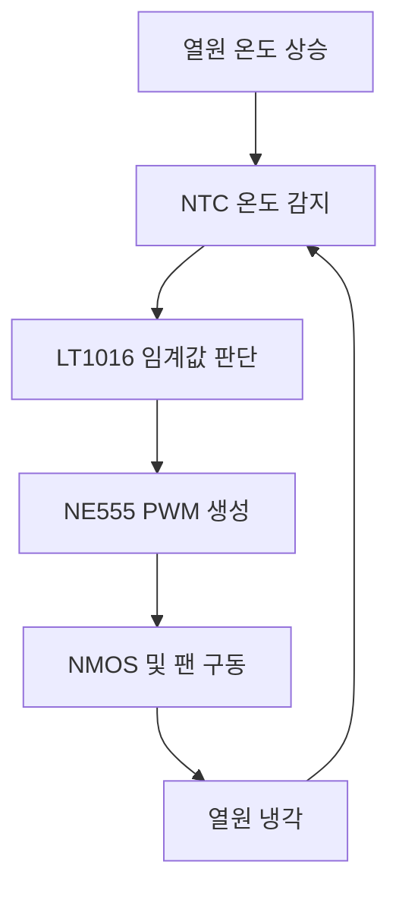

[시뮬레이션_revised.md](https://github.com/user-attachments/files/31767675/_revised.md)# LTspice 기반 자동 온도 제어 팬 설계

> NTC Thermistor, LT1016 Comparator, NE555, NMOS, DC Fan 등가모델을 이용한 폐루프 온도 제어 시스템

| 항목    | 내용                                                   |
| ----- | ---------------------------------------------------- |
| 프로젝트  | Automatic Temperature Control Fan                    |
| 개발 도구 | LTspice 26.0.2                                       |
| 설계 분야 | Analog Circuit / Power Electronics / Thermal Control |
| 제어 목표 | 약 50℃에서 팬 ON, 약 45℃에서 팬 OFF                          |
| 제어 방식 | NTC 온도 감지 + Comparator 히스테리시스 + PWM 팬 구동             |
| 작성자   | 김의겸                                                  |

---

## 1. 프로젝트 개요

본 프로젝트는 열원의 온도가 일정 수준 이상으로 상승했을 때 냉각팬을 자동으로 작동시키고, 온도가 충분히 내려가면 팬을 정지시키는 자동 온도 제어 시스템이다.

단순히 정해진 시간에 팬을 켜고 끄는 방식이 아니라, 팬의 작동 결과가 다시 온도에 영향을 주도록 다음과 같은 폐루프 구조를 구현하였다.



설계 목표는 다음과 같다.

* 열원 온도가 약 50℃까지 올라가면 팬 작동
* 팬 냉각으로 온도가 약 45℃까지 내려가면 팬 정지
* 하나의 임계값에서 팬이 빠르게 켜지고 꺼지는 채터링 방지
* 비교기 출력만으로 팬을 직접 구동하지 않고 MOSFET을 이용한 전력 스위칭 구현
* LTspice에서 온도 상승과 냉각이 반복되는 폐루프 동작 검증
* 각 제어 단계의 출력 파형을 개별적으로 측정하여 신호 전달 과정 확인

---

## 2. 최종 결과 요약

최종 시뮬레이션에서 다음과 같은 동작을 확인하였다.

| 측정 대상      | 측정 노드         |    파형 범위 | 의미              |
| ---------- | ------------- | -------: | --------------- |
| 열원 온도      | `V(temp_mon)` | 약 45~49℃ | 제어 범위 안에서 온도 반복 |
| 팬 속도 표시값   | `V(rpm)`      |  약 0~10V | 팬 정지 및 작동 반복    |
| LT1016 출력  | `V(n003)`     | 약 0~3.7V | 온도 임계값 판단 결과    |
| NE555 출력   | `V(n005)`     |   약 0~5V | MOSFET 구동용 PWM  |
| MOSFET 게이트 | `V(n006)`     |   약 0~5V | NMOS ON/OFF 제어  |

이론적으로 계산한 제어 임계값은 다음과 같다.

```text
온도 상승 시 팬 ON  : 약 49.3℃
온도 하강 시 팬 OFF : 약 45.5℃
히스테리시스 폭     : 약 3.8℃
```

따라서 목표였던 약 45~50℃ 범위와 유사한 온도 제어가 이루어졌다.

---

## 3. 전체 시스템 구성

전체 신호 전달 순서는 다음과 같다.

```text
열원 및 열용량 모델
        ↓
NTC Thermistor
        ↓
온도에 따른 센서전압 생성
        ↓
LT1016 Comparator
        ↓
히스테리시스를 이용한 ON/OFF 판단
        ↓
NE555 PWM Generator
        ↓
NMOS Gate 구동
        ↓
5V Fan 등가모델
        ↓
RPM 신호 생성
        ↓
열 모델에 냉각량 반영
```

주요 회로 요소와 역할은 다음과 같다.

| 구분      | 회로 요소             | 역할                      |
| ------- | ----------------- | ----------------------- |
| 열원 모델   | `B_TH`            | 가열량, 자연 방열량, 팬 냉각량 계산   |
| 열용량 모델  | `C_TH`            | 온도가 즉시 변하지 않도록 열관성 구현   |
| 온도센서    | R4 NTC            | 온도 변화에 따른 저항 변화         |
| 센서 분압   | R3 10kΩ, R4 NTC   | NTC 저항을 비교 가능한 전압으로 변환  |
| 기준전압    | R6 10kΩ, R9 3.9kΩ | LT1016의 기준전압 생성         |
| 히스테리시스  | R5 68kΩ           | 팬 ON 온도와 OFF 온도를 다르게 설정 |
| 비교기     | U3 LT1016         | 센서전압과 기준전압 비교           |
| PWM 발생기 | U1 NE555          | MOSFET 구동용 PWM 생성       |
| 게이트 저항  | R2 100Ω           | MOSFET 게이트 충·방전 전류 제한   |
| 스위칭 소자  | M1 NMOS           | 팬 전류의 로우사이드 스위칭         |
| 팬 모델    | `FAN5V.lib`       | 팬 코일 및 RPM 표시값 구현       |
| 보호 다이오드 | D3 1N5819         | 팬 코일의 역기전력 억제           |

---

## 4. 열 등가회로를 이용한 온도 모델

### 4.1 온도를 전압으로 표현한 이유

LTspice는 전압과 전류를 계산하는 회로 시뮬레이터이므로 실제 온도 단위인 ℃를 직접 회로 노드에 사용할 수 없다.

따라서 본 프로젝트에서는 다음과 같은 대응 관계를 사용하였다.

```text
TEMP_MON 노드의 1V = 1℃
```

예를 들어 다음과 같이 측정되었다면,

```text
V(TEMP_MON) = 48V
```

실제 회로에 48V가 인가되었다는 뜻이 아니라, 열 모델 내부의 온도가 48℃라는 뜻이다.

---

### 4.2 열 모델 설정값

열 모델에 사용한 파라미터는 다음과 같다.

```spice
.param Tamb=25
.param Rth=5
.param Cth=0.5
.param Pheat=6
.param Pcool=15

C_TH TEMP_MON 0 {Cth} IC=40

B_TH 0 TEMP_MON I={
 Pheat
 -(V(TEMP_MON)-Tamb)/Rth
 -Pcool*if(V(RPM)>0.5,1,0)
}
```

| 변수      | 설정값 | 의미                |
| ------- | --: | ----------------- |
| `Tamb`  |  25 | 주변 온도 25℃         |
| `Rth`   |   5 | 열원과 주변 사이의 열저항    |
| `Cth`   | 0.5 | 열원의 열용량           |
| `Pheat` |   6 | 열원에서 지속적으로 발생하는 열 |
| `Pcool` |  15 | 팬 작동 시 적용되는 냉각량   |
| `IC`    |  40 | 시뮬레이션 시작 온도 40℃   |

이 모델은 다음 열평형식을 회로 형태로 표현한다.

$$
C_{th}\frac{dT}{dt}
===================

## P_{heat}

## \frac{T-T_{amb}}{R_{th}}

P_{cool}\cdot Fan
$$

여기서 팬의 상태는 다음 조건으로 결정된다.

$$
Fan=
\begin{cases}
0, & V(RPM)\leq0.5 \
1, & V(RPM)>0.5
\end{cases}
$$

---

### 4.3 팬이 정지했을 때

팬이 정지하면 냉각항이 제거되고 열원에서 발생하는 열에 의해 온도가 상승한다.

팬이 계속 꺼져 있다고 가정했을 때의 최종 평형온도는 다음과 같다.

$$
T_{eq}=T_{amb}+P_{heat}R_{th}
$$

$$
T_{eq}=25+(6\times5)=55℃
$$

따라서 냉각팬이 작동하지 않으면 열원 온도는 약 55℃를 향해 상승한다.

---

### 4.4 팬이 작동했을 때

팬이 작동하여 `V(RPM)>0.5` 조건이 만족되면 `Pcool=15`에 해당하는 냉각량이 열 모델에 적용된다.

이 냉각량은 가열량보다 크므로 열원 온도가 감소한다.

```text
팬 OFF → 냉각항 제거 → 온도 상승
팬 ON  → 냉각항 적용 → 온도 하강
```

온도가 하한 임계값까지 내려가면 팬이 정지하고, 냉각항이 제거되면서 열원 온도가 다시 상승한다.

이 과정이 반복되면서 온도 파형이 톱니 형태로 나타난다.

---

## 5. NTC Thermistor 온도 감지

### 5.1 NTC의 저항 변화

R4에는 25℃에서 10kΩ인 NTC Thermistor 모델을 사용하였다.

```spice
.param Beta=3950
.param R25=10000

R=R25*exp(
 Beta*(1/(V(TEMP_MON)+273.15)-1/298.15)
)
```

NTC 저항은 다음 식으로 계산된다.

$$
R_{NTC}(T)
==========

R_{25}
\exp
\left[
B\left(
\frac{1}{T+273.15}
------------------

\frac{1}{298.15}
\right)
\right]
$$

여기서:

* $R_{25}=10k\Omega$
* $B=3950$
* $T$는 ℃ 단위의 `TEMP_MON` 온도
* `273.15`는 섭씨온도를 절대온도로 변환하기 위한 값
* `298.15K`는 25℃에 해당하는 절대온도

NTC는 온도가 올라가면 저항이 감소한다.

|  온도 | 계산된 NTC 저항 |
| --: | ---------: |
| 40℃ |   약 5.30kΩ |
| 45℃ |   약 4.35kΩ |
| 48℃ |   약 3.87kΩ |
| 49℃ |   약 3.73kΩ |
| 50℃ |   약 3.59kΩ |

---

### 5.2 저항 변화를 전압으로 변환

LT1016은 저항값이 아니라 두 입력단의 전압을 비교한다.

따라서 R3 10kΩ과 R4 NTC를 분압회로로 구성하여 NTC의 저항 변화를 센서전압 변화로 바꾸었다.

센서전압은 다음과 같다.

$$
V_{sensor}
==========

5\frac{R_{NTC}}{10k+R_{NTC}}
$$

온도가 올라가면 NTC 저항이 감소하므로 센서전압도 낮아진다.

```text
온도 상승
→ NTC 저항 감소
→ 센서전압 감소

온도 하강
→ NTC 저항 증가
→ 센서전압 증가
```

이 센서전압은 LT1016의 반전 입력인 `−IN`에 전달된다.

---

## 6. LT1016 비교기와 히스테리시스

### 6.1 비교기 입력 구성

LT1016의 입력은 다음과 같이 연결하였다.

```text
+IN : R6-R9 분압회로에서 생성된 기준전압
−IN : R3-NTC 분압회로에서 생성된 센서전압
```

LT1016의 기본 동작은 다음과 같다.

```text
V(+IN) > V(−IN) → 출력 HIGH
V(+IN) < V(−IN) → 출력 LOW
```

온도가 올라가면 NTC 센서전압이 낮아진다. 센서전압이 기준전압보다 낮아지는 순간 LT1016 출력이 HIGH로 전환된다.

```text
온도 상승
→ 센서전압 감소
→ 기준전압이 센서전압보다 높아짐
→ LT1016 출력 HIGH
→ 팬 작동 허용
```

---

### 6.2 기본 기준전압

R6 10kΩ과 R9 3.9kΩ만 고려한 기준전압은 다음과 같다.

$$
V_{ref}
=======

5\frac{3.9k}{10k+3.9k}
$$

$$
V_{ref}\approx1.403V
$$

그러나 실제 회로에는 LT1016 출력에서 기준전압 노드로 연결된 R5 68kΩ이 존재한다. 따라서 LT1016 출력 상태에 따라 기준전압이 달라진다.

---

### 6.3 히스테리시스가 필요한 이유

팬을 하나의 온도만 기준으로 제어하면 임계점 부근에서 다음과 같은 문제가 발생할 수 있다.

```text
온도가 임계값보다 조금 높아짐 → 팬 ON
온도가 아주 조금 내려감       → 팬 OFF
온도가 다시 조금 높아짐       → 팬 ON
```

이처럼 팬이 짧은 시간 동안 빠르게 켜지고 꺼지는 현상을 채터링이라고 한다.

채터링은 다음 문제를 일으킬 수 있다.

* 팬의 반복적인 기동으로 수명 감소
* MOSFET의 불필요한 스위칭 증가
* 전원 노이즈 증가
* 제어 시스템의 불안정한 동작
* 실제 사용자가 느끼는 소음 증가

본 회로에서는 R5 68kΩ의 양의 피드백을 이용하여 팬을 켜는 온도와 끄는 온도를 다르게 만들었다.

---

### 6.4 팬 ON 임계값 계산

LT1016 출력이 LOW일 때 기준전압은 다음과 같이 계산된다.

$$
V_{ref,L}
=========

\frac{
5/10k+0/68k
}{
1/10k+1/3.9k+1/68k
}
$$

$$
V_{ref,L}\approx1.347V
$$

이 센서전압에 해당하는 NTC 저항과 온도를 역산하면 팬의 작동 온도는 약 49.3℃이다.

```text
온도 상승 시 약 49.3℃에서 팬 ON
```

---

### 6.5 팬 OFF 임계값 계산

파형에서 확인한 LT1016의 HIGH 출력은 약 3.7V이다.

이를 기준전압 계산에 반영하면 다음과 같다.

$$
V_{ref,H}
=========

\frac{
5/10k+3.7/68k
}{
1/10k+1/3.9k+1/68k
}
$$

$$
V_{ref,H}\approx1.494V
$$

이 전압에 해당하는 온도를 역산하면 팬의 정지 온도는 약 45.5℃이다.

```text
온도 하강 시 약 45.5℃에서 팬 OFF
```

따라서 본 회로의 이론적인 제어 범위는 다음과 같다.

| 상태       | 이론적 임계온도 |
| -------- | -------: |
| 팬 ON     |  약 49.3℃ |
| 팬 OFF    |  약 45.5℃ |
| 히스테리시스 폭 |   약 3.8℃ |

처음 목표로 설정했던 45~50℃ 범위와 유사한 결과이다.

---

### 6.6 초기온도 40℃와 OFF 임계값의 차이

온도 파형이 40℃에서 시작한다고 해서 팬의 OFF 임계값이 40℃라는 뜻은 아니다.

열 모델에는 다음 초기조건이 설정되어 있다.

```spice
C_TH TEMP_MON 0 {Cth} IC=40
```

따라서 40℃는 시뮬레이션을 시작하기 위해 설정한 초기온도이다.

```text
40℃      : 시뮬레이션 시작 온도
약 45.5℃ : 정상 반복 동작에서 팬이 꺼지는 온도
약 49.3℃ : 정상 반복 동작에서 팬이 켜지는 온도
```

초기 구간이 끝난 후에는 온도가 약 45~49℃ 범위에서 반복된다.

---

## 7. LT1016 출력 파형 분석


LT1016 출력은 회로의 `V(n003)` 노드에서 측정하였다.

파형에서 확인되는 출력 범위는 다음과 같다.

```text
LOW  ≈ 0V
HIGH ≈ 3.7V
```

LT1016 출력이 주기적으로 HIGH와 LOW를 반복한다는 것은 NTC 센서전압이 히스테리시스의 두 임계값을 반복해서 통과하고 있다는 뜻이다.

```text
온도 약 49.3℃ 도달
        ↓
NTC 센서전압 감소
        ↓
LT1016 출력 HIGH
        ↓
팬 작동
        ↓
온도 하강
        ↓
온도 약 45.5℃ 도달
        ↓
LT1016 출력 LOW
```

LT1016의 HIGH 출력이 전원전압인 5V까지 올라가지 않고 약 3.7V에서 형성되었지만, NE555의 RESET 입력을 활성화하기에는 충분한 전압이다.

---

## 8. NE555의 역할과 PWM 출력

### 8.1 NE555를 사용한 이유

LT1016은 센서전압과 기준전압을 비교하여 팬을 켜야 하는지 판단하는 소자이다.

그러나 LT1016 출력만으로 팬에 필요한 전류를 직접 공급할 수는 없다. 따라서 LT1016은 NE555의 동작 여부를 제어하고, NE555가 MOSFET을 구동할 PWM 신호를 생성하도록 구성하였다.

```text
LT1016 LOW
→ NE555 RESET 활성화
→ NE555 출력 정지
→ MOSFET OFF
→ 팬 정지

LT1016 HIGH
→ NE555 RESET 해제
→ NE555 PWM 출력
→ MOSFET 스위칭
→ 팬 작동
```

---

### 8.2 NE555 발진회로

NE555 주변의 다음 부품들은 타이밍 커패시터의 충전 및 방전 경로를 구성한다.

* R1 4.7kΩ
* R8 4.7kΩ
* R11 15kΩ
* D1
* D2
* C2 100nF

D1과 D2를 서로 반대 방향으로 배치하여 C2가 충전될 때와 방전될 때 서로 다른 저항 경로를 사용하도록 구성하였다.

이를 통해 PWM의 HIGH 시간과 LOW 시간을 구분할 수 있다.

---

### 8.3 NE555 출력 파형


NE555 출력은 `V(n005)` 노드에서 측정하였다.

```text
LOW  ≈ 0V
HIGH ≈ 5V
```

긴 시간축에서 PWM을 측정하면 수많은 펄스가 한 화면에 압축되기 때문에 파형이 굵은 직사각형 묶음처럼 보인다.

파형을 해석할 때는 다음 두 동작을 구분해야 한다.

* 빠르게 반복되는 개별 펄스: NE555가 생성한 PWM
* PWM 펄스가 나타나는 전체 구간: LT1016이 팬 작동을 허용한 구간

즉, LT1016이 온도에 따라 팬의 큰 ON/OFF 구간을 결정하고, 해당 ON 구간 안에서 NE555가 빠른 PWM을 생성한다.

---

## 9. MOSFET 게이트 구동

### 9.1 MOSFET 게이트 전압


`V(n006)`은 NE555 출력이 R2 100Ω을 지난 뒤의 MOSFET 게이트 전압이다.

```text
NE555 OUT ─ R2 100Ω ─ M1 Gate
```

따라서 이 파형은 MOSFET의 드레인 전압이나 팬 양단전압이 아니라 MOSFET을 켜고 끄는 게이트 제어 전압이다.

```text
Gate LOW  ≈ 0V
Gate HIGH ≈ 5V
```

MOSFET 모델은 다음과 같이 설정하였다.

```spice
.model NMOS_FAN NMOS(
 Level=1
 Vto=2
 Kp=20
 Lambda=0.01
)
```

문턱전압 `Vto`가 2V이므로 게이트에 약 5V가 인가되면 MOSFET이 ON 상태가 된다.

```text
게이트 0V
→ M1 OFF
→ 팬의 GND 전류 경로 차단
→ 팬 정지

게이트 5V
→ M1 ON
→ 팬의 GND 전류 경로 형성
→ 팬 전류 흐름
→ 팬 작동
```

---

### 9.2 게이트 저항 R2

R2 100Ω은 NE555 출력과 MOSFET 게이트 사이에 연결되어 있다.

MOSFET 게이트는 정상상태에서는 전류를 거의 소비하지 않지만, 내부적으로 커패시터와 같은 특성을 가지므로 ON/OFF 순간에는 충·방전 전류가 흐른다.

R2의 역할은 다음과 같다.

* 게이트 충·방전 순간의 피크전류 제한
* NE555 출력단 보호
* 지나치게 빠른 스위칭 완화
* 배선 인덕턴스와 게이트 커패시턴스에 의한 링잉 감소
* 고주파 노이즈 억제

NE555 출력인 `V(n005)`와 MOSFET 게이트인 `V(n006)`의 파형이 거의 동일한 이유는 정상상태에서 R2 양단의 전압강하가 매우 작기 때문이다.

R2는 주로 스위칭이 일어나는 짧은 순간에 영향을 준다.

---

## 10. MOSFET 로우사이드 스위칭

M1은 팬 아래쪽에서 GND 경로를 제어하는 로우사이드 스위치로 사용하였다.

```text
5V 전원
   ↓
5V Fan Model
   ↓
FAN_MINUS
   ↓
M1 Drain
M1 Source
   ↓
GND
```

MOSFET이 ON되면 팬 전류가 다음 경로로 흐른다.

```text
5V 전원 → 팬 코일 → MOSFET → GND
```

MOSFET이 OFF되면 팬에서 GND로 이어지는 전류 경로가 차단되어 팬이 정지한다.

비교기나 NE555가 팬 전류를 직접 공급하지 않고 MOSFET의 게이트만 제어하기 때문에 작은 논리 신호로 비교적 큰 팬 전류를 제어할 수 있다.

---

## 11. 역기전력 보호 다이오드

팬 모델에는 인덕턴스가 포함되어 있다.

인덕터에 흐르던 전류는 MOSFET이 갑자기 꺼져도 즉시 0이 되지 않으려고 한다. 따라서 MOSFET이 OFF되는 순간 높은 역기전력이 발생할 수 있다.

이를 억제하기 위해 D3에 Schottky 다이오드인 1N5819를 사용하였다.

D3는 다음 역할을 한다.

* MOSFET OFF 순간 팬 코일 전류의 순환 경로 제공
* MOSFET 드레인의 과도전압 억제
* 스위칭 소자 보호
* 전원 및 주변 회로에 전달되는 노이즈 감소

1N5819는 일반 정류 다이오드보다 순방향 전압이 낮고 스위칭이 빠르기 때문에 저전압 팬의 역기전력 보호에 적합하다.

---

## 12. 5V 팬 등가모델

사용한 팬 라이브러리는 다음과 같다.

```spice
.subckt FAN5V P N RPM
Rcoil P X 8
Lcoil X N 300u
Bspeed RPM 0 V={limit(V(P,N),0,5)*2.0}
Rrpm RPM 0 1Meg
.ends FAN5V
```

### 12.1 팬 코일 모델

팬의 전기적 특성은 다음 두 소자로 단순화하였다.

| 소자      |     값 | 의미            |
| ------- | ----: | ------------- |
| `Rcoil` |    8Ω | 팬 권선의 저항 성분   |
| `Lcoil` | 300µH | 팬 권선의 인덕턴스 성분 |

이 모델은 실제 BLDC 팬의 모든 내부 구조를 구현한 정밀 모터 모델은 아니다.

실제 팬에 포함되는 다음 요소들은 생략되어 있다.

* 회전자 관성
* 마찰
* 부하 토크
* 역기전력 상수
* 내부 BLDC 드라이버
* 실제 기동시간
* 실제 RPM 상승 및 감소 지연

따라서 이 모델은 전체 온도 제어 시스템의 동작을 확인하기 위한 간이 등가모델로 사용하였다.

---

### 12.2 RPM 표시 신호

RPM 출력은 다음 식으로 생성된다.

```spice
Bspeed RPM 0 V={limit(V(P,N),0,5)*2.0}
```

팬 양단전압을 0~5V 범위로 제한한 후 2배하여 RPM 표시 노드에 출력한다.

본 프로젝트에서는 다음과 같은 표시 기준을 사용하였다.

```text
V(RPM) 1V = 1000rpm
```

| `V(RPM)` | 표시되는 회전속도 |
| -------: | --------: |
|       0V |      0rpm |
|       2V |  2,000rpm |
|       5V |  5,000rpm |
|      10V | 10,000rpm |

파형에서 `V(rpm)`이 약 10V까지 올라가는 것은 팬에 10V가 공급되었다는 뜻이 아니다.

팬 양단전압을 RPM으로 환산한 모델 내부의 표시값이며, 해당 모델 기준으로 약 10,000rpm을 의미한다.

다만 이 값은 실제 회전자의 기계적 속도를 계산한 것이 아니라 팬 양단전압을 단순 변환한 값이다. 실제 제작 시에는 팬의 데이터시트와 타코미터 측정값을 이용한 보정이 필요하다.

---

## 13. 온도 및 RPM 파형 분석


첫 번째 파형에서:

* 파란색 `V(temp_mon)`은 열원 온도
* 초록색 `V(rpm)`은 팬 회전속도 표시값

파란색 온도 파형은 약 45~49℃ 범위에서 반복적으로 상승하고 하강한다.

초록색 RPM 파형은 온도가 상한 임계값에 도달하면 상승하고, 온도가 하한 임계값까지 내려가면 다시 0으로 떨어진다.

```text
온도 상승
→ 상한 임계값 도달
→ 팬 작동
→ RPM 발생
→ 냉각량 증가
→ 온도 하강
→ 하한 임계값 도달
→ 팬 정지
→ RPM 제거
→ 온도 재상승
```

이를 통해 팬의 작동 결과가 다시 온도 모델에 영향을 주는 폐루프 동작이 구현되었음을 확인하였다.

---

## 14. 전체 동작 과정

### 14.1 초기 가열

시뮬레이션은 `IC=40` 조건에 따라 40℃에서 시작한다.

초기에는 팬이 정지해 있으므로 열원에서 발생하는 열에 의해 온도가 상승한다.

```text
팬 OFF
→ 냉각항 제거
→ 열원 온도 상승
→ NTC 저항 감소
→ 센서전압 감소
```

---

### 14.2 팬 작동

온도가 약 49.3℃에 도달하면 NTC 센서전압이 기준전압보다 낮아진다.

```text
V(+IN) > V(−IN)
→ LT1016 출력 HIGH
→ NE555 RESET 해제
→ NE555 PWM 발생
→ MOSFET 게이트 스위칭
→ MOSFET ON
→ 팬 작동
→ RPM 신호 발생
```

---

### 14.3 냉각

RPM 신호가 0.5V보다 높아지면 열 모델에서 냉각 조건이 활성화된다.

```spice
Pcool*if(V(RPM)>0.5,1,0)
```

이에 따라 `Pcool=15`의 냉각량이 적용되고 온도가 하강한다.

```text
팬 작동
→ 냉각량 적용
→ 열원 온도 감소
→ NTC 저항 증가
→ 센서전압 증가
```

---

### 14.4 팬 정지

온도가 약 45.5℃까지 떨어지면 센서전압이 기준전압보다 높아진다.

```text
V(−IN) > V(+IN)
→ LT1016 출력 LOW
→ NE555 RESET
→ PWM 출력 정지
→ MOSFET 게이트 0V
→ MOSFET OFF
→ 팬 정지
→ 냉각항 제거
```

팬이 정지하면 열원에서 발생하는 열 때문에 온도가 다시 상승한다.

이 과정이 시뮬레이션 종료 시점까지 반복된다.

---

## 15. 파형을 통한 단계별 검증

각 단계의 출력 파형을 비교하면 다음 신호 전달 관계를 확인할 수 있다.

| 단계         | 노드            |    출력 범위 | 검증 내용        |
| ---------- | ------------- | -------: | ------------ |
| 온도 모델      | `V(temp_mon)` | 약 45~49V | 가열과 냉각 반복    |
| 비교기        | `V(n003)`     | 약 0~3.7V | 임계온도 판단      |
| PWM 발생기    | `V(n005)`     |   약 0~5V | 팬 구동용 PWM 생성 |
| MOSFET 게이트 | `V(n006)`     |   약 0~5V | PWM 신호 정상 전달 |
| 팬 모델       | `V(rpm)`      |  약 0~10V | 팬 정지와 작동 반복  |

파형의 시간적 순서는 다음과 같다.

```text
1. 온도가 상한 임계값에 도달한다.
2. LT1016 출력이 HIGH로 전환된다.
3. NE555가 PWM을 생성한다.
4. MOSFET 게이트에 0~5V PWM이 전달된다.
5. MOSFET이 팬 전류를 스위칭한다.
6. RPM 표시값이 상승한다.
7. 열 모델에 냉각량이 적용된다.
8. 온도가 하한 임계값까지 내려간다.
9. LT1016 출력이 LOW로 전환된다.
10. PWM과 팬 구동이 정지한다.
11. 온도가 다시 상승한다.
```

---

## 16. R10 중복 배선 분석

최종 회로에는 LT1016 출력과 NE555 RESET 입력 사이에 R10 100Ω이 배치되어 있다.

그러나 회로 작성 과정에서 R10 양단이 전선으로 직접 연결되면서 R10이 우회된 상태가 되었다.

```text
LT1016 OUT ───────── NE555 RESET
             │
           R10 100Ω
             │
       전선에 의해 우회
```

따라서 현재 시뮬레이션에서 R10에는 실질적인 전압강하가 발생하지 않으며, 전기적으로는 LT1016 출력과 NE555 RESET 입력이 직접 연결된 것과 같다.

그런데도 회로가 정상 동작한 이유는 NE555 RESET 단자가 팬과 같은 전력 부하가 아니라 입력 임피던스가 높은 논리 제어 단자이기 때문이다.

LT1016 출력이 NE555 RESET 입력을 직접 구동하더라도 큰 전류가 흐르지 않으므로 시뮬레이션 동작에는 문제가 발생하지 않았다.

다만 최종 회로도에서는 중복 배선을 정리해야 한다.

수정 방법은 다음 두 가지가 가능하다.

```text
방법 1: 우회 전선을 삭제하고 R10을 정상적인 직렬 저항으로 사용
방법 2: R10이 불필요하다고 판단되면 R10을 제거하고 직접 연결
```

실제 제작용 회로에서는 회로의 설계 의도를 분명하게 표시하기 위해 중복 배선을 제거할 예정이다.

이 실수는 시뮬레이션의 동작 여부뿐 아니라 회로도의 가독성, 설계 의도, 실제 PCB 제작 가능성까지 확인해야 한다는 점을 학습한 사례이다.

---

## 17. 시뮬레이션 모델의 한계

본 프로젝트는 자동 온도 제어 시스템의 전체적인 신호 흐름을 검증하기 위한 시스템 수준의 시뮬레이션이다.

따라서 다음과 같은 한계가 존재한다.

### 17.1 온도 모델

`TEMP_MON`은 실제 온도가 아니라 `1V=1℃`로 대응시킨 계산용 노드이다.

실제 열전달에서 발생하는 다음 요소들은 단순화되어 있다.

* 열원 내부의 온도 분포
* 방열판의 형상
* 공기의 유동
* 팬과 열원 사이의 거리
* 주변 온도 변화
* 자연대류와 강제대류의 차이

### 17.2 팬 냉각량

현재 열 모델은 `V(RPM)>0.5`가 되면 `Pcool=15` 전체를 적용하는 ON/OFF 방식이다.

따라서 RPM이 증가할수록 냉각량이 연속적으로 증가하는 실제 팬의 특성은 반영되지 않았다.

### 17.3 RPM 모델

`V(RPM)`은 팬 양단전압을 변환한 표시값이다.

실제 회전자 관성, 마찰, 토크 및 기동시간은 계산하지 않는다.

### 17.4 MOSFET 모델

MOSFET은 Level 1 단순 모델을 사용하였다.

따라서 실제 부품의 다음 특성이 정확히 반영되지 않았다.

* $R_{DS(on)}$
* Gate Charge
* 기생 커패시턴스
* 스위칭 손실
* 도통 손실
* 온도에 따른 특성 변화
* MOSFET 자체 발열

### 17.5 NTC 모델

NTC는 이상적인 Beta 식으로 계산하였다.

실제 NTC에서 발생하는 다음 요소들은 포함되지 않았다.

* 저항 허용오차
* Beta 값 허용오차
* 자기발열
* 응답 지연
* 배선저항
* 부품별 편차

---

## 18. 향후 개선 계획

시뮬레이션의 정확도를 높이고 실제 제작으로 확장하기 위해 다음 항목을 개선할 예정이다.

* RPM에 비례하여 냉각량이 연속적으로 변하는 열 모델 구현
* 팬 회전자의 관성과 기동시간을 포함한 동적 모델 구현
* 실제 MOSFET 제조사 SPICE 모델 적용
* MOSFET의 도통 손실 및 스위칭 손실 측정
* 팬 평균전류와 순간전류 측정
* NTC 허용오차를 반영한 Monte Carlo 해석
* 전원전압 변화에 따른 임계온도 오차 분석
* NE555 PWM 주파수 및 듀티비 최적화
* 실제 팬의 최소 기동전압 및 최소 기동 듀티비 검증
* R10 중복 배선 제거 및 최종 회로도 정리
* KiCad를 이용한 PCB 설계
* 실제 온도센서와 팬을 이용한 하드웨어 제작
* 실제 측정 결과와 LTspice 시뮬레이션 결과 비교

---

## 19. 프로젝트를 통해 학습한 내용

본 프로젝트를 통해 단순히 개별 부품의 사용법뿐 아니라 센서, 제어회로, 스위칭 소자, 부하 및 열 모델이 연결되는 전체 시스템을 학습하였다.

주요 학습 내용은 다음과 같다.

* NTC Thermistor의 비선형 저항 특성
* 분압회로를 이용한 저항-전압 변환
* Comparator의 반전 및 비반전 입력 동작
* 양의 피드백을 이용한 히스테리시스 구현
* NE555를 이용한 PWM 생성
* MOSFET의 게이트 구동 원리
* 로우사이드 스위칭 구조
* 인덕성 부하의 역기전력과 Flyback Diode
* 열저항과 열용량을 이용한 열 등가회로
* LTspice 행동 전원과 조건식을 이용한 시스템 모델링
* 파형을 이용한 단계별 신호 검증
* 이론 계산값과 시뮬레이션 결과 비교
* 시뮬레이션 모델과 실제 부품 사이의 차이
* 동작 여부뿐 아니라 회로도 배선과 설계 의도까지 검토하는 과정

---

## 20. 결론

본 프로젝트에서는 NTC Thermistor, LT1016 Comparator, NE555, NMOS 및 5V 팬 등가모델을 이용하여 자동 온도 제어 팬 시스템을 구현하였다.

NTC의 비선형적인 저항 변화를 분압전압으로 변환하고, LT1016이 이를 기준전압과 비교하도록 구성하였다. 또한 R5 68kΩ의 양의 피드백을 적용하여 팬을 켜는 온도와 끄는 온도를 다르게 설정하였다.

회로값과 LT1016의 실제 출력전압을 반영하여 계산한 결과는 다음과 같다.

```text
팬 ON  : 약 49.3℃
팬 OFF : 약 45.5℃
```

LT1016의 약 0~3.7V 출력은 NE555의 RESET 입력을 제어하고, NE555는 약 0~5V의 PWM을 생성한다. 이 PWM은 R2 100Ω을 통해 MOSFET 게이트로 전달되어 팬 전류를 스위칭한다.

최종 파형에서는 다음 관계가 반복적으로 나타났다.

```text
온도 상승
→ LT1016 출력 전환
→ NE555 PWM 발생
→ MOSFET 구동
→ 팬 작동
→ 냉각
→ 온도 하강
→ 팬 정지
→ 온도 재상승
```

이를 통해 온도 감지, 임계값 판단, PWM 생성, 전력 스위칭, 팬 구동 및 냉각 피드백으로 이어지는 전체 폐루프가 정상적으로 동작함을 확인하였다.

또한 초기온도 40℃와 실제 팬 OFF 임계값을 구분하고, 저항값과 비교기 출력전압을 이용해 약 45.5~49.3℃의 제어 범위를 직접 계산함으로써 시뮬레이션 파형이 나타나는 원인을 정량적으로 분석하였다.

현재 팬과 열 모델은 시스템 동작 검증을 위한 단순화된 등가모델이다. 향후 실제 회로 제작 단계에서는 NTC 허용오차, 팬 기동 특성, 실제 RPM, MOSFET 손실 및 열전달 특성을 측정하고 시뮬레이션 결과와 비교할 예정이다.

[Uploadin# Simulation Verification Report

> Automatic Temperature Control Fan  
> LTspice 기반 폐루프 온도 제어 시스템의 **최종 검증 결과**를 정리한 문서

---

## 1. 문서 목적

이 문서는 회로의 동작 원리를 다시 설명하기 위한 문서가 아니라,
최종 LTspice 회로가 설계 의도대로 동작하는지 **파형과 계산값을 기준으로 검증**하기 위한 보고서이다.

검증 대상은 다음 다섯 단계이다.

```text
Temperature
    ↓
LT1016 Comparator
    ↓
NE555 Pulse/PWM
    ↓
MOSFET Gate
    ↓
Fan / RPM
    ↓
Thermal Feedback
```

검증에서는 각 Block의 출력이 단독으로 정상인지뿐 아니라,
앞 단계의 상태 변화가 다음 단계에 시간적으로 올바르게 전달되는지도 확인하였다.

---

## 2. Simulation 조건

최종 Transient Analysis는 다음 조건으로 수행하였다.

```spice
.tran 0 60 0 10m startup
```

Thermal Model의 주요 파라미터는 다음과 같다.

```spice
.param Tamb=25
.param Rth=5
.param Cth=0.5
.param Pheat=6
.param Pcool=15

C_TH TEMP_MON 0 {Cth} IC=40
B_TH 0 TEMP_MON I={
 Pheat
 -(V(TEMP_MON)-Tamb)/Rth
 -Pcool*if(V(RPM)>0.5,1,0)
}
```

NTC Model은 다음과 같다.

```spice
.param Beta=3950
.param R25=10000

R=R25*exp(
 Beta*(1/(V(TEMP_MON)+273.15)-1/298.15)
)
```

Fan Model은 다음과 같다.

```spice
.subckt FAN5V P N RPM
Rcoil P X 8
Lcoil X N 300u
Bspeed RPM 0 V={limit(V(P,N),0,5)*2.0}
Rrpm RPM 0 1Meg
.ends FAN5V
```

MOSFET은 학습용 단순 모델을 사용하였다.

```spice
.model NMOS_FAN NMOS(
 Level=1
 Vto=2
 Kp=20
 Lambda=0.01
)
```

---

## 3. 검증 목표

최종 Simulation의 Pass 기준을 다음과 같이 설정하였다.

| 검증 항목 | 목표 |
|---|---|
| Temperature Control | 약 45~50℃ 범위에서 반복 |
| Fan ON Threshold | 약 50℃ 부근 |
| Fan OFF Threshold | 약 45℃ 부근 |
| Chattering | 단일 임계점 반복 Switching 없이 상태 유지 |
| Comparator Output | 온도 임계값에서 HIGH/LOW 전환 |
| NE555 Output | Fan 허용 구간에서 Pulse/PWM 발생 |
| MOSFET Gate | NE555 신호가 Gate까지 전달 |
| Fan Feedback | Fan ON 후 Temperature 감소 |
| Closed-loop | 가열 → Fan ON → 냉각 → Fan OFF 반복 |

---

# 4. 이론값 계산

## 4.1 NTC Sensor Voltage

R3 10kΩ과 NTC가 다음과 같이 구성되어 있다.

```text
5V
 │
R3 10kΩ
 │
 ├── Sensor Voltage
 │
R4 NTC
 │
GND
```

따라서

```text
Vsensor = 5 × RNTC / (10k + RNTC)
```

이다.

대표적인 계산값은 다음과 같다.

| Temperature | NTC Resistance | Sensor Voltage |
|---:|---:|---:|
| 40℃ | 약 5.30kΩ | 약 1.73V |
| 45℃ | 약 4.35kΩ | 약 1.52V |
| 48℃ | 약 3.87kΩ | 약 1.40V |
| 49℃ | 약 3.73kΩ | 약 1.36V |
| 50℃ | 약 3.59kΩ | 약 1.32V |

온도가 상승할수록 Sensor Voltage가 감소하는 것이 정상이다.

---

## 4.2 Comparator 기본 Reference

R6 10kΩ과 R9 3.9kΩ만 고려하면 기본 Reference Voltage는

```text
Vref
= 5 × 3.9k / (10k + 3.9k)
≈ 1.403V
```

이다.

하지만 최종 회로에는 R5 68kΩ Positive Feedback이 있으므로
Comparator Output 상태에 따라 Reference Voltage가 이동한다.

---

## 4.3 Fan ON Threshold

Comparator Output이 LOW일 때를 약 0V로 두면

```text
Vref,L
≈ (5/10k + 0/68k)
  / (1/10k + 1/3.9k + 1/68k)

≈ 1.347V
```

이 된다.

이 Sensor Voltage에 대응하는 NTC 저항과 온도를 역산하면

```text
Fan ON ≈ 49.3℃
```

를 얻는다.

---

## 4.4 Fan OFF Threshold

Simulation에서 관찰된 LT1016 HIGH Output을 약 3.7V로 반영하면

```text
Vref,H
≈ (5/10k + 3.7/68k)
  / (1/10k + 1/3.9k + 1/68k)

≈ 1.494V
```

이다.

이를 NTC 온도로 역산하면

```text
Fan OFF ≈ 45.5℃
```

를 얻는다.

따라서 이론적인 Hysteresis Width는

```text
49.3 - 45.5
≈ 3.8℃
```

이다.

---

# 5. 측정 노드

최종 검증에서 사용한 주요 신호는 다음과 같다.

| Signal | Node | 의미 |
|---|---|---|
| Temperature | `V(temp_mon)` | 열원 온도 표시값 (`1V = 1℃`) |
| Comparator | `V(n003)` | LT1016의 온도 판단 결과 |
| NE555 | `V(n005)` | Pulse/PWM Output |
| MOSFET Gate | `V(n006)` | NMOS Gate Drive |
| Fan State | `V(rpm)` | Fan Model의 RPM 표시 신호 |

---

# 6. 결과 요약

최종 Simulation에서 확인한 범위는 다음과 같다.

| 측정 대상 | 관찰 범위 | 판정 |
|---|---:|---|
| `V(temp_mon)` | 약 45~49V | PASS |
| `V(rpm)` | 약 0~10V | PASS |
| `V(n003)` | 약 0~3.7V | PASS |
| `V(n005)` | 약 0~5V | PASS |
| `V(n006)` | 약 0~5V | PASS |
| Fan ON | 약 49℃ 부근 | PASS |
| Fan OFF | 약 45~46℃ 부근 | PASS |
| 반복 가열·냉각 | 확인 | PASS |

온도 목표값인 45~50℃와 비교했을 때
Simulation은 약 45~49℃ 범위에서 반복되었다.

정밀한 실물 Calibration 결과가 아니라
현재 Equivalent Model 기준으로 목표 범위에 근접한 동작을 확인한 결과이다.

---

# 7. Temperature / RPM 검증

## 7.1 확인하려는 내용

Temperature와 Fan State가 다음과 같이 반대 방향으로 연동되는지 확인하였다.

```text
Fan OFF
→ Temperature 상승

Fan ON
→ Temperature 하강
```

---

## 7.2 관찰 결과

`V(temp_mon)`은 정상 반복 구간에서 약 45~49V 사이를 오르내렸다.

본 모델은

```text
1V = 1℃
```

로 정의했으므로 이는 약 45~49℃에 해당한다.

`V(rpm)`은 Temperature가 상한에 도달한 뒤 활성화되고,
Temperature가 하한에 도달하면 다시 0으로 내려갔다.

---

## 7.3 판정

**PASS**

단순히 Fan Signal이 출력되는 것이 아니라,
Fan Output이 Thermal Model의 Cooling 항을 활성화하면서
실제로 Temperature 기울기가 상승에서 하강으로 바뀌었다.

이를 통해 Closed-loop Feedback이 형성되었음을 확인하였다.

---

# 8. LT1016 Comparator 검증

## 8.1 예상 동작

온도가 상승하면 NTC Sensor Voltage는 감소한다.

```text
Temperature ↑
→ RNTC ↓
→ Vsensor ↓
```

Comparator는

```text
+IN = Reference
-IN = Sensor
```

구조이므로 Sensor Voltage가 충분히 낮아지면
LT1016 Output이 HIGH 방향으로 전환되어야 한다.

---

## 8.2 관찰 결과

`V(n003)`에서 대략 다음 두 상태를 확인하였다.

```text
LOW  ≈ 0V
HIGH ≈ 3.7V
```

Temperature가 상한에 도달하면 HIGH가 되고,
Temperature가 하한까지 내려가면 LOW로 돌아갔다.

---

## 8.3 판정

**PASS**

Comparator Output과 Temperature Threshold가 시간적으로 연동되었다.

또한 HIGH Output이 이상적인 5V가 아니라 약 3.7V라는 점을
Hysteresis 계산에도 반영하였다.

---

# 9. Hysteresis 검증

## 9.1 확인 기준

Hysteresis가 없다면
Fan은 하나의 온도 근처에서 반복적으로 빠르게 ON/OFF될 수 있다.

Hysteresis가 정상이라면 동일한 중간 온도에서도
이전 상태에 따라 Fan 상태가 달라져야 한다.

예를 들어 약 48℃에서

```text
가열 중 → Fan OFF 가능
냉각 중 → Fan ON 유지 가능
```

가 되어야 한다.

---

## 9.2 관찰 결과

Fan은 상한 임계값에 도달한 뒤 켜졌고,
Temperature가 상한보다 낮아진 직후에도 즉시 꺼지지 않았다.

Temperature가 하한 임계값까지 충분히 감소한 뒤에 Fan이 OFF되었다.

---

## 9.3 판정

**PASS**

R5 68kΩ Positive Feedback이
단순한 ON 범위를 만드는 것이 아니라
두 개의 서로 다른 Switching Threshold를 형성하는 것을 확인하였다.

---

# 10. NE555 Output 검증

## 10.1 예상 동작

LT1016이 Fan 구동을 허용하는 상태일 때
NE555가 MOSFET Gate 구동용 Pulse/PWM을 발생시켜야 한다.

Temperature에 따라 직접 Duty를 연속 조절하는 구조가 아니라,

> **Comparator가 Fan 구동 구간을 결정하고, 그 구간에서 NE555 Pulse/PWM이 활성화되는 구조**

이다.

---

## 10.2 관찰 결과

`V(n005)`에서 약 0~5V 범위의 Pulse/PWM을 확인하였다.

긴 60초 시간축에서는 빠른 개별 Pulse들이 압축되어
굵은 띠 형태로 보일 수 있다.

따라서 두 시간 규모를 구분하였다.

```text
Fast Scale
→ NE555의 개별 Pulse/PWM

Slow Scale
→ Comparator가 허용한 Fan ON 구간
```

---

## 10.3 판정

**PASS**

Comparator Output 이후 NE555가 정상적으로 활성화되어
MOSFET 구동 신호를 생성하였다.

---

# 11. MOSFET Gate 검증

## 11.1 예상 동작

NE555 Output은 R2 100Ω을 지나
MOSFET Gate에 전달된다.

```text
NE555 OUT
   ↓
R2 100Ω
   ↓
M1 Gate
```

---

## 11.2 관찰 결과

`V(n006)`은 약 0~5V로 Switching하였다.

`V(n005)`와 전체적인 형태가 유사하며,
이를 통해 NE555 Output이 Gate까지 정상적으로 전달되는 것을 확인하였다.

---

## 11.3 판정

**PASS**

Gate LOW에서는 M1이 OFF 방향,
Gate HIGH에서는 M1이 ON 방향으로 동작하였다.

현재 MOSFET은 단순 Level 1 Model이므로
이 결과를 실제 Power MOSFET의 Switching Loss나
정확한 `RDS(on)` 성능으로 해석하지는 않았다.

---

# 12. Fan Model 검증

## 12.1 모델 목적

`FAN5V.lib`는 실제 BLDC Motor의 모든 기계적 특성을 구현한 모델이 아니다.

주요 목적은

- 유도성 부하 구성
- Fan 전압 상태 표현
- RPM 표시 신호 생성
- Thermal Feedback Trigger 생성

이다.

---

## 12.2 RPM Signal

Fan Model은

```spice
Bspeed RPM 0 V={limit(V(P,N),0,5)*2.0}
```

을 사용한다.

본 프로젝트에서는 표시 기준을

```text
V(RPM) 1V ≈ 1000 rpm 표시값
```

으로 해석하였다.

따라서 `V(RPM)`이 약 10V라고 해서
Fan에 실제 10V가 인가되었다는 의미는 아니다.

또한 이 값은 실제 Rotor의 운동방정식으로 계산한 RPM이 아니라
Fan 양단전압을 단순 변환한 **상태 표시 신호**이다.

---

## 12.3 판정

**PASS — System-level Model 기준**

Fan 구동 상태와 Cooling Feedback을 연결하기 위한 목적에는 정상적으로 사용되었다.

실제 Fan RPM 성능 검증에는 사용할 수 없다.

---

# 13. Closed-loop Sequence 검증

파형을 시간 순서로 정리하면 다음과 같다.

```text
① Initial Temperature = 40℃
        ↓
② Fan OFF
        ↓
③ Pheat에 의해 Temperature 상승
        ↓
④ NTC Resistance 감소
        ↓
⑤ Sensor Voltage 감소
        ↓
⑥ 약 49℃ 부근에서 LT1016 Output HIGH
        ↓
⑦ NE555 Pulse/PWM 활성화
        ↓
⑧ MOSFET Gate Switching
        ↓
⑨ Fan / RPM 활성화
        ↓
⑩ Thermal Cooling 적용
        ↓
⑪ Temperature 하강
        ↓
⑫ 약 45~46℃ 부근에서 LT1016 Output LOW
        ↓
⑬ NE555 Output 정지
        ↓
⑭ MOSFET OFF
        ↓
⑮ Fan OFF / Cooling 제거
        ↓
⑯ Temperature 재상승
```

이 Sequence가 Simulation 종료 시점까지 반복되었다.

---

## 판정

**PASS**

각 Block을 개별적으로만 확인한 것이 아니라
하나의 Block에서 발생한 상태 변화가
다음 Block으로 순차적으로 전달되는 것을 확인하였다.

---

# 14. 초기조건 40℃ 해석

Simulation은

```spice
IC=40
```

으로 시작한다.

따라서 첫 Temperature 값이 약 40℃인 것은
Fan OFF Threshold가 40℃라는 의미가 아니다.

```text
40℃
= Simulation Initial Condition

약 45.5℃
= 정상 반복 상태의 Fan OFF Threshold

약 49.3℃
= 정상 반복 상태의 Fan ON Threshold
```

검증에서는 초기 Transient보다
반복 동작이 안정된 이후의 범위를 기준으로 판단하였다.

---

# 15. 예상값과 관찰값 비교

| 항목 | 설계/계산 기준 | 관찰 결과 | 평가 |
|---|---:|---:|---|
| Fan ON | 약 49.3℃ | 약 49℃ 부근 | 근접 |
| Fan OFF | 약 45.5℃ | 약 45~46℃ | 근접 |
| Temperature Range | 약 45.5~49.3℃ | 약 45~49℃ | 근접 |
| Comparator HIGH | 계산에 실제값 반영 | 약 3.7V | 확인 |
| NE555 HIGH | 약 5V | 약 5V | 확인 |
| MOSFET Gate HIGH | 약 5V | 약 5V | 확인 |

현재 측정은 파형에서 읽은 근사값이므로
소수점 단위의 정밀 측정값으로 해석하지 않았다.

---

# 16. R10 배선 검토

회로를 다시 검토하는 과정에서
LT1016 Output과 NE555 제어 입력 사이의 R10 100Ω이
전선에 의해 우회되는 형태로 연결되어 있음을 확인하였다.

즉 현재 Simulation에서는

```text
R10
```

의 실질적인 전기적 역할이 없다.

현재 결과가 동작하는 이유는
해당 NE555 입력이 Fan과 같은 전력 부하가 아니기 때문에
직접 연결 상태에서도 Simulation이 진행되기 때문이다.

하지만 최종 Hardware 또는 정리된 Schematic에서는
다음 중 하나로 의도를 명확하게 해야 한다.

```text
1. R10이 필요하면 Bypass Wire 제거
2. R10이 필요 없으면 R10 제거
```

이 항목은 **Simulation PASS와 별개의 Schematic Quality Issue**로 기록하였다.

---

# 17. Model Limitations

## 17.1 Thermal Model

현재 Thermal Model은 Lumped Equivalent Model이다.

포함하지 않는 요소:

- 열원 내부의 공간적 온도분포
- 방열판 형상
- 공기 유동
- Fan 위치
- 자연대류/강제대류의 상세 차이
- 실제 Material Thermal Property

---

## 17.2 Cooling Model

현재는

```text
V(RPM) > 0.5
```

이면 `Pcool=15`가 전체 적용된다.

따라서 실제 Fan처럼 RPM이나 풍량에 따라
Cooling Power가 연속적으로 달라지는 구조는 아니다.

---

## 17.3 Fan Model

현재 Fan Model에는 다음 특성이 없다.

- Rotor Inertia
- Torque
- Friction
- 실제 Speed-dependent Back EMF
- BLDC Driver 동작
- Starting Delay
- Stall

---

## 17.4 MOSFET Model

현재 Level 1 Model에는 실제 Power MOSFET의 다음 특성이 충분히 반영되지 않는다.

- `RDS(on)`
- Gate Charge
- `Ciss`, `Coss`, `Crss`
- Switching Loss
- Conduction Loss
- Temperature Dependence
- Self-heating

---

## 17.5 NTC Model

현재 NTC는 Ideal Beta Equation 기반이다.

포함하지 않는 요소:

- Resistance Tolerance
- Beta Tolerance
- Self-heating
- Sensor Response Time
- Wiring Resistance
- Mounting Position

---

# 18. 추가 검증이 필요한 항목

Hardware 제작 단계에서는 다음 항목을 실제 측정으로 확인할 필요가 있다.

| 항목 | 측정 목적 |
|---|---|
| 실제 NTC R-T 특성 | Simulation Sensor Model 보정 |
| LT1016 Output Swing | Hysteresis Threshold 정밀 계산 |
| Comparator Input Offset | 온도 Threshold 오차 분석 |
| Fan Starting Voltage | 실제 Fan 기동 가능성 확인 |
| Fan Starting Duty | PWM 구동 시 기동 조건 확인 |
| 실제 RPM | `FAN5V.lib` 표시값 보정 |
| MOSFET `VGS` | Gate Drive 확인 |
| MOSFET `VDS` / `IDS` | Power Stage 동작 확인 |
| MOSFET Temperature | 손실 및 Thermal Margin 확인 |
| Flyback Spike | Protection Circuit 검증 |
| Temperature Slope | `Rth`, `Cth`, `Pcool` 보정 |

---

# 19. 최종 Verification Matrix

| Requirement | Result | Status |
|---|---|---|
| NTC가 온도 상승을 전압 감소로 변환 | 확인 | PASS |
| LT1016이 상한에서 상태 전환 | 확인 | PASS |
| Hysteresis로 ON/OFF Threshold 분리 | 확인 | PASS |
| NE555 Pulse/PWM 발생 | 확인 | PASS |
| Pulse/PWM이 MOSFET Gate까지 전달 | 확인 | PASS |
| NMOS가 Fan 구동 상태를 Switching | 확인 | PASS |
| Fan 상태가 RPM Signal에 반영 | 확인 | PASS |
| RPM Signal이 Cooling에 반영 | 확인 | PASS |
| Fan ON 후 Temperature 감소 | 확인 | PASS |
| Fan OFF 후 Temperature 재상승 | 확인 | PASS |
| 약 45~50℃ 범위에 근접 | 약 45~49℃ | PASS |
| 실제 Hardware 정밀 모델 | 미검증 | FUTURE WORK |

---

# 20. 결론

최종 LTspice Simulation을 통해

```text
Temperature
→ NTC
→ LT1016
→ NE555
→ NMOS
→ Fan
→ Cooling
→ Temperature
```

로 이어지는 전체 Closed-loop Signal Chain을 검증하였다.

최종 결과는 대략

```text
Fan ON  ≈ 49.3℃
Fan OFF ≈ 45.5℃
Hysteresis ≈ 3.8℃
```

로 계산되었으며,
실제 Simulation 파형에서도 약 45~49℃ 범위의 반복 가열·냉각 동작을 확인하였다.

또한

```text
LT1016 Output : 약 0~3.7V
NE555 Output  : 약 0~5V
MOSFET Gate   : 약 0~5V
RPM Signal    : 약 0~10V
```

을 개별적으로 확인하여
각 제어 단계가 순서대로 연결되고 있음을 검증하였다.

따라서 현재 회로는 **System-level Simulation 기준에서 설계 목표를 만족**한다고 판단하였다.

다만 Fan, MOSFET, NTC 및 Thermal Model이 단순화되어 있으므로
이 결과를 실제 Hardware의 정밀 온도·RPM·손실값으로 직접 해석해서는 안 된다.

향후 실물 측정값을 이용해 Thermal Parameter와 Device Model을 보정하면
현재 Simulation을 실제 시스템에 가까운
**Electro-Thermal Verification Model**로 발전시킬 수 있다.
g 시뮬레이션_revised.md…]()
